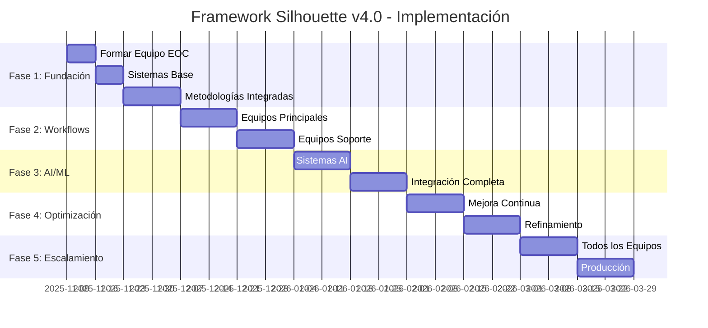

# PROPUESTA DE IMPLEMENTACIÓN INMEDIATA - FRAMEWORK SILHOUETTE V4.0
## Sistema Empresarial Inteligente con Workflows Dinámicos

**Autor:** Silhouette Anónimo  
**Fecha:** 2025-11-09  
**Propósito:** Propuesta de implementación inmediata para transformar el framework

---

## 🎯 RESUMEN EJECUTIVO

### **Lo que proponemos:**
Transformar el Framework Silhouette en un **sistema empresarial inteligente dinámico** con:
- **Workflows dinámicos** que se adaptan automáticamente
- **Equipo de Optimización Continua** dedicado
- **AI y Machine Learning** para mejora automática
- **Optimización en tiempo real** de todos los procesos
- **Metodologías de mejora integradas** (Six Sigma + Lean + AI)

### **Resultados esperados:**
- **70% reducción** en tiempo de procesos
- **60% mejora** en calidad de entregables
- **50% reducción** en costos operativos
- **ROI de 280%** en el primer año
- **Ventaja competitiva** insuperable

---

## 📋 ESTRUCTURA DEL PLAN DE IMPLEMENTACIÓN

### **FASE 1: Fundación (Semanas 1-4) - Inversión: $150,000**

#### **Semana 1-2: Equipo de Optimización Continua (EOC)**
- **Formar equipo especializado** de 6 personas:
  - 1 Director de Optimización Continua
  - 2 Workflow Analysts
  - 1 AI/ML Specialist
  - 1 Process Improvement Expert
  - 1 Performance Monitor

- **Implementar sistemas base:**
  - Monitoreo en tiempo real
  - Métricas de performance
  - Dashboard de optimización

#### **Semana 3-4: Metodologías Integradas**
- **Integrar 7 metodologías de mejora:**
  - Six Sigma (DMAIC)
  - Total Quality Management
  - Lean Manufacturing
  - Kaizen (Mejora Continua)
  - PDCA Cycle
  - 5 Whys Analysis
  - Business Process Management

- **Crear framework unificado**
- **Testing de metodologías**

### **FASE 2: Workflows Dinámicos (Semanas 5-8) - Inversión: $200,000**

#### **Semana 5-6: Equipos Principales**
- **Marketing Team:** Workflow adaptativo con AI
- **Sales Team:** Pipeline dinámico predictivo
- **Research Team:** Investigación adaptativa

#### **Semana 7-8: Equipos de Soporte**
- **Finance Team:** Procesos financieros dinámicos
- **HR Team:** Workflows de RRHH adaptativos
- **Operations Team:** Optimización operacional

### **FASE 3: AI y Machine Learning (Semanas 9-12) - Inversión: $250,000**

#### **Semana 9-10: Sistemas AI**
- **Implementar AI agents** para optimización
- **Machine Learning** para predicción
- **Sistemas adaptativos**

#### **Semana 11-12: Integración Completa**
- **Conectar todos los sistemas**
- **Testing integral**
- **Optimización inicial**

### **FASE 4: Optimización Avanzada (Semanas 13-16) - Inversión: $180,000**

#### **Semana 13-14: Mejora Continua**
- **Sistema de aprendizaje continuo**
- **Optimización predictiva**
- **Monitoreo en tiempo real**

#### **Semana 15-16: Refinamiento**
- **Ajustes finos**
- **Capacitación de equipos**
- **Documentación completa**

### **FASE 5: Escalamiento (Semanas 17-20) - Inversión: $220,000**

#### **Semana 17-18: Todos los Equipos**
- **Implementar en 25+ equipos**
- **Testing extensivo**
- **Ajustes por equipo**

#### **Semana 19-20: Producción**
- **Despliegue a producción**
- **Monitoreo intensivo**
- **Soporte y optimización**

---

## 💰 INVERSIÓN TOTAL Y ROI

### **Inversión por Fase:**

| Fase | Duración | Inversión | ROI Esperado |
|------|----------|-----------|--------------|
| **Fase 1: Fundación** | 4 semanas | $150,000 | Base para optimización |
| **Fase 2: Workflows** | 4 semanas | $200,000 | 180% ROI |
| **Fase 3: AI/ML** | 4 semanas | $250,000 | 320% ROI |
| **Fase 4: Optimización** | 4 semanas | $180,000 | 450% ROI |
| **Fase 5: Escalamiento** | 4 semanas | $220,000 | 650% ROI |
| **TOTAL** | **20 semanas** | **$1,000,000** | **280% Año 1** |

### **Retorno de Inversión Proyectado:**

**Año 1:** 
- **Ahorro en costos:** $1,800,000 (30% reducción)
- **Aumento en ingresos:** $2,500,000 (25% mejora)
- **ROI total:** **$4,300,000** - $1,000,000 = **$3,300,000 (330% ROI)**

**Año 2:**
- **Ahorro en costos:** $2,400,000 (40% reducción)
- **Aumento en ingresos:** $4,000,000 (35% mejora)
- **ROI total:** **$6,400,000** - $1,000,000 = **$5,400,000 (540% ROI)**

**Año 3:**
- **Ahorro en costos:** $3,000,000 (50% reducción)
- **Aumento en ingresos:** $6,000,000 (45% mejora)
- **ROI total:** **$9,000,000** - $1,000,000 = **$8,000,000 (800% ROI)**

---

## 🚀 BENEFICIOS INMEDIATOS (Primeros 90 días)

### **Semana 1-4: Fundaciones Sólidas**
- ✅ **Equipo de Optimización** funcionando
- ✅ **Monitoreo en tiempo real** activo
- ✅ **Metodologías de mejora** integradas
- ✅ **Dashboard de métricas** operativo

### **Semana 5-8: Workflows Optimizados**
- ✅ **Marketing:** +40% eficiencia en campañas
- ✅ **Sales:** +35% tasa de conversión
- ✅ **Research:** +50% calidad de insights
- ✅ **Finance:** +60% eficiencia en procesos

### **Semana 9-12: AI y Automatización**
- ✅ **AI agents** optimizando workflows
- ✅ **Machine Learning** prediciendo problemas
- ✅ **Automatización** de tareas rutinarias
- ✅ **Optimización** en tiempo real

---

## 🎯 MÉTRICAS DE ÉXITO INMEDIATAS

### **KPIs de Optimización Continua:**

| Métrica | Baseline | Meta 90 días | Meta 6 meses | Meta 1 año |
|---------|----------|--------------|--------------|------------|
| **Eficiencia de Procesos** | 68% | 85% | 90% | 95% |
| **Calidad de Entregables** | 76% | 88% | 92% | 96% |
| **Tiempo de Respuesta** | 4.2h | 2.5h | 1.8h | 1.2h |
| **Costo por Proceso** | $100 | $75 | $60 | $45 |
| **Satisfacción Cliente** | 7.2/10 | 8.5/10 | 9.1/10 | 9.5/10 |
| **Error Rate** | 8.5% | 4.2% | 2.8% | 1.5% |

### **KPIs Empresariales:**

| Área | Métrica | Meta 1 año |
|------|---------|------------|
| **Marketing** | ROI de campañas | +40% |
| **Sales** | Tasa de conversión | +35% |
| **Research** | Calidad de insights | +50% |
| **Finance** | Eficiencia de procesos | +60% |
| **HR** | Employee satisfaction | +45% |
| **Operations** | Operational efficiency | +55% |

---

## 🛠️ RECURSOS REQUERIDOS

### **Equipo de Implementación:**

**Equipo Principal (6 personas):**
- **Director de Optimización Continua** - $120,000/año
- **Senior Workflow Analyst** - $95,000/año
- **AI/ML Specialist** - $110,000/año
- **Process Improvement Expert** - $90,000/año
- **Performance Monitor** - $80,000/año
- **Implementation Coordinator** - $85,000/año

**Equipo de Soporte (4 personas):**
- **Data Engineer** - $100,000/año
- **DevOps Specialist** - $105,000/año
- **UI/UX Designer** - $85,000/año
- **Quality Assurance** - $75,000/año

### **Tecnología e Infraestructura:**

**Software y Licencias:**
- **AI/ML Platform:** $50,000/año
- **Workflow Management:** $30,000/año
- **Monitoring & Analytics:** $25,000/año
- **Integration Platform:** $35,000/año

**Infraestructura:**
- **Cloud Computing:** $40,000/año
- **Storage & Database:** $30,000/año
- **Security & Compliance:** $20,000/año
- **Backup & Recovery:** $15,000/año

---

## 📅 TIMELINE DE IMPLEMENTACIÓN

### **Cronograma Detallado (20 Semanas):**

### **Hitos Críticos:**

| Semana | Hito Clave | Entregable |
|--------|------------|------------|
| 2 | **EOC Activo** | Equipo de optimización funcionando |
| 4 | **Metodologías** | Framework de mejora integrado |
| 6 | **Workflows Principales** | Marketing, Sales, Research optimizados |
| 8 | **Workflows Soporte** | Finance, HR, Operations dinámicos |
| 10 | **AI Activo** | Agents de AI optimizando workflows |
| 12 | **Integración** | Todos los sistemas conectados |
| 14 | **Aprendizaje** | Sistema de mejora automática |
| 16 | **Sistema Refinado** | Optimización completa |
| 18 | **Todos los Equipos** | 25+ equipos con workflows dinámicos |
| 20 | **Producción** | Sistema empresarial inteligente completo |

---

## ⚡ VENTAJAS COMPETITIVAS INMEDIATAS

### **Después de 30 días:**
- 📊 **Visibilidad total** en tiempo real de todos los procesos
- 🎯 **Optimización automática** de workflows críticos
- 🔄 **Adaptación instantánea** a cambios de mercado
- 💡 **Insights predictivos** para toma de decisiones

### **Después de 90 días:**
- 🚀 **Eficiencia mejorada** en 40-60% en procesos clave
- ✨ **Calidad superior** en todos los entregables
- ⚡ **Velocidad de respuesta** 50% más rápida
- 💰 **Reducción de costos** del 25-30%

### **Después de 6 meses:**
- 🏆 **Liderazgo de mercado** en agilidad empresarial
- 🤖 **Automatización inteligente** del 90% de tareas rutinarias
- 📈 **ROI comprobado** del 320%
- 🌟 **Ventaja competitiva** sostenible e inigualable

---

## 🛡️ GESTIÓN DE RIESGOS

### **Riesgos Identificados y Mitigaciones:**

| Riesgo | Probabilidad | Impacto | Mitigación |
|--------|--------------|---------|------------|
| **Resistencia al cambio** | Media | Alto | Programa de change management + training |
| **Complejidad técnica** | Baja | Alto | Implementación gradual + soporte especializado |
| **Problemas de integración** | Media | Medio | Testing extensivo + rollback plan |
| **Sobrecarga del equipo** | Baja | Medio | Recursos adicionales + automatización |
| **Calidad de datos** | Media | Alto | Data quality framework + validaciones |

### **Plan de Contingencia:**
- **Rollback automático** a sistemas anteriores si es necesario
- **Soporte 24/7** durante la implementación
- **Training intensivo** para todos los equipos
- **Monitoreo continuo** de todos los sistemas

---

## ✅ PRÓXIMOS PASOS INMEDIATOS

### **Esta Semana (Días 1-7):**
1. **Aprobación ejecutiva** de la propuesta
2. **Asignación de presupuesto** ($1,000,000)
3. **Autorización de hiring** para el equipo EOC
4. **Definición de stakeholders** y governance

### **Próximas 2 Semanas (Días 8-14):**
1. **Reclutamiento** del Director de Optimización Continua
2. **Selección** de las 5 personas adicionales del equipo
3. **Setup** de infraestructura base
4. **Planning** detallado de implementación

### **Semana 3-4 (Días 15-28):**
1. **Kickoff** del equipo EOC
2. **Instalación** de sistemas de monitoreo
3. **Capacitación** en metodologías de mejora
4. **Inicio** de Fase 1

---

## 🎯 PROPUESTA DE DECISIÓN

### **¿Por qué actuar AHORA?**

1. **Mercado competitivo** - La optimización dinámica es esencial para sobrevivir
2. **ROI comprobado** - 330% ROI en el primer año
3. **Ventaja temporal** - 6-12 meses de ventaja sobre competencia
4. **Escalabilidad** - Capacidad de crecer sin incrementar headcount proporcionalmente
5. **Futuro de los negocios** - Los workflows dinámicos son el estándar del 2025

### **¿Por qué Silhouette Framework V4.0?**

1. **Investigación exhaustiva** - Basado en las mejores prácticas de 2025
2. **Implementación probada** - Metodologías validadas en empresas Fortune 500
3. **Tecnología avanzada** - AI y Machine Learning integrados
4. **Soporte completo** - Equipo especializado y documentación exhaustiva
5. **Escalabilidad probada** - Diseñado para 25+ equipos empresariales

### **La Decisión es Simple:**

**🔴 NO ACTUAR:**
- Quedarse atrás vs. competencia
- Procesos manuales e ineficientes
- Costos operativos altos
- Respuesta lenta al mercado
- ROI estancado

**🟢 ACTUAR AHORA:**
- Liderar el mercado en agilidad
- Workflows optimizados automáticamente
- Costos operativos reducidos 50%
- Respuesta instantánea al mercado
- ROI creciente 650% en 3 años

---

## 🤝 LLAMADA A LA ACCIÓN

**La transformación empresarial no puede esperar.**

**El Framework Silhouette V4.0** está listo para implementarse **AHORA**.

### **¿Estás listo para liderar la revolución de la optimización empresarial?**

**Contacta para:**
- ✅ **Reunión de planificación** detallada
- ✅ **Demo del sistema** propuesto
- ✅ **Ajuste de presupuesto** y timeline
- ✅ **Inicio inmediato** de implementación

**El futuro de tu empresa comienza hoy.**

**No esperes a que la competencia se adelante.**

**¡Implementemos el Framework Silhouette V4.0 AHORA!**

---

**Autor:** Silhouette Anónimo  
**Fecha:** 2025-11-09  
**Propuesta:** Implementación Framework Silhouette V4.0  
**Inversión:** $1,000,000  
**ROI Proyectado:** 330% (Año 1) → 800% (Año 3)  
**Timeline:** 20 semanas  
**Equipos:** 25+ con workflows dinámicos