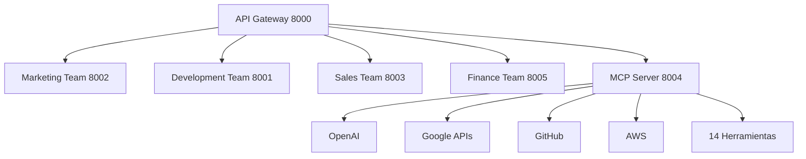
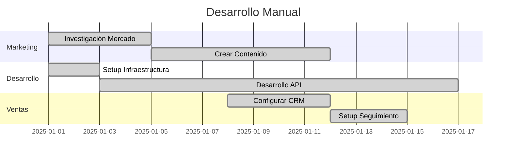

# 🤔 ¿Qué es un Framework y por qué este Sistema es un Framework?

## 📋 **Definición de Framework**

Un **framework** es una **estructura base o plataforma reutilizable** que proporciona:

### **🎯 Características Esenciales de un Framework:**

1. **🏗️ Arquitectura Predefinida** - Estructura organizacional establecida
2. **🔧 Herramientas Integradas** - Conjunto de herramientas listas para usar
3. **📐 Reglas y Convenciones** - Patrones de desarrollo establecidos
4. **♻️ Reutilización** - Uso para múltiples proyectos/aplicaciones
5. **🚀 Productividad** - Acelera el desarrollo de aplicaciones
6. **🎛️ Puntos de Extensión** - Permite personalización y expansión

### **🏆 Framework vs. Aplicación Normal**

| **Aplicación Normal** | **Framework** |
|----------------------|---------------|
| Solve un problema específico | Resuelve problemas generales |
| Códiogo específico para un uso | Código reutilizable para múltiples usos |
| Flexible al diseño | Arquitectura predefinida |
| Inicio desde cero | Puntos de partida establecidos |
| Funcionalidades específicas | Conjunto de herramientas |
| Resultado final | Plataforma para construir |

---

## 🏗️ **¿Por qué el Sistema Multiagente es un Framework?**

### **✅ 1. Arquitectura Predefinida**


**✅ CUMPLE:** El sistema tiene una arquitectura clara y predefinida que cualquier aplicación puede seguir.

### **✅ 2. Herramientas Integradas**
```javascript
// 25 servicios disponibles
const servicios = {
    gateway: 'http://localhost:8000',      // Orquestador
    marketing: 'http://localhost:8002',    // 50+ endpoints
    development: 'http://localhost:8001',  // 50+ endpoints
    sales: 'http://localhost:8003',        // 50+ endpoints
    mcp: 'http://localhost:8004',          // 14 herramientas
    // ... 20 equipos más
};
```

**✅ CUMPLE:** Contiene 25 servicios especializados + 14 herramientas del mundo real.

### **✅ 3. Reglas y Convenciones**
```javascript
// Patrón estándar para todos los endpoints
{
    "status": "success|error",
    "service": "team_name",
    "endpoint": "action_name",
    "data": {},
    "timestamp": "ISO-8601",
    "event_sourcing": {
        "event_id": "uuid",
        "event_type": "event_type"
    }
}
```

**✅ CUMPLE:** Todos los servicios siguen el mismo patrón de API y arquitectura.

### **✅ 4. Reutilización (Característica Principal)**

#### **Ejemplo 1: E-commerce Store**
```javascript
// Usar el framework para crear un e-commerce
const ecommercer = new MultiAgenteSDK('http://localhost:8000');
const resultado = await ecommercer.orquestarLanzamientoProducto({
    nombre: "TechStore",
    categoria: "e-commerce",
    equipos: ["marketing", "desarrollo", "ventas"]
});
```

#### **Ejemplo 2: App de Delivery**
```javascript
// Mismo framework, diferente aplicación
const deliveryApp = new MultiAgenteSDK('http://localhost:8000');
const resultado = await deliveryApp.orquestarLanzamientoProducto({
    nombre: "FoodDelivery",
    categoria: "food_service",
    equipos: ["marketing", "desarrollo", "ventas"]
});
```

#### **Ejemplo 3: Plataforma Educativa**
```javascript
// Tercer proyecto, mismo framework
const edutech = new MultiAgenteSDK('http://localhost:8000');
const resultado = await edutech.orquestarLanzamientoProducto({
    nombre: "LearnPro",
    categoria: "education",
    equipos: ["marketing", "desarrollo", "ventas"]
});
```

**✅ CUMPLE:** Un solo framework usado para crear múltiples aplicaciones diferentes.

### **✅ 5. Puntos de Extensión**

#### **Extender con nuevo equipo:**
```javascript
// Añadir equipo legal al framework
const legalTeam = {
    service: 'legal-team',
    port: 8026,
    endpoints: [
        '/legal/contract-review',
        '/legal/compliance-check',
        '/legal/terms-generation'
    ]
};
```

#### **Añadir nueva herramienta MCP:**
```python
# Nueva herramienta: Zoom API
@tool('zoom_meeting')
async def create_zoom_meeting(self, parameters):
    # Lógica de integración
    pass
```

**✅ CUMPLE:** El sistema permite agregar nuevos equipos, herramientas y funcionalidades.

### **✅ 6. Productividad Masiva**

#### **Antes (Desarrollo Manual):**


**⏱️ Total: 4-6 semanas**

#### **Ahora (Con Framework):**
```javascript
// Todo en una llamada
const resultado = await framework.orquestarLanzamientoCompleto({
    producto: "Mi App",
    equipos: ["marketing", "desarrollo", "ventas"],
    automatizar: true
});
// ⏱️ Total: 2-4 horas
```

**✅ CUMPLE:** Acelera el desarrollo de 4-6 semanas a 2-4 horas.

---

## 🏆 **Ejemplos de Frameworks Conocidos para Comparar**

### **🌐 React (Frontend Framework)**
```javascript
// React: Framework para interfaces de usuario
import React from 'react';
import ReactDOM from 'react-dom';

// Tu aplicación usa React
function MiApp() {
    return <div>¡Mi aplicación!</div>;
}

ReactDOM.render(<MiApp />, document.getElementById('root'));
```

**¿Por qué es un framework?**
- Arquitectura predefinida (component-based)
- Herramientas integradas (JSX, hooks, state)
- Reutilización en múltiples proyectos
- Puntos de extensión (custom hooks, components)

### **🟢 Node.js + Express (Backend Framework)**
```javascript
// Express: Framework para APIs
const express = express();
const app = express();

// Tu API usa Express
app.get('/api/productos', (req, res) => {
    res.json({ productos: [] });
});

app.listen(3000);
```

**¿Por qué es un framework?**
- Arquitectura predefinida (routing, middleware)
- Herramientas integradas (cors, json parsing)
- Reutilización en múltiples APIs
- Puntos de extensión (custom middleware)

### **🤖 Framework Multiagente (Nuestro Sistema)**
```javascript
// Framework Multiagente: Framework empresarial
const framework = new MultiAgenteSDK('http://localhost:8000');

// Tu aplicación empresarial usa el framework
const resultado = await framework.marketing.generarEstrategia({
    producto: "Mi App",
    audiencia: "desarrolladores"
});
```

**¿Por qué es un framework?**
- ✅ Arquitectura predefinida (25 servicios + orquestador)
- ✅ Herramientas integradas (14 herramientas del mundo real)
- ✅ Reutilización en múltiples aplicaciones empresariales
- ✅ Puntos de extensión (nuevos equipos, herramientas MCP)

---

## 🔍 **Características que lo Hacen ser un Framework, NO una Aplicación**

### **❌ NO es una Aplicación porque:**
1. **No resuelve un problema específico** - Resuelve problemas generales
2. **No tiene una interfaz de usuario** - Es backend puro para otros
3. **No es un producto final** - Es una plataforma para construir productos
4. **No tiene lógica de negocio específica** - Tiene lógica de orquestación

### **✅ SÍ es un Framework porque:**
1. **Proporciona estructura reutilizable** - 25 servicios organizados
2. **Ofrece herramientas integradas** - 14 APIs del mundo real
3. **Establece patrones** - Arquitectura Event Sourcing + CQRS
4. **Permite extensión** - Agregar nuevos equipos y herramientas
5. **Acelera desarrollo** - De semanas a horas
6. **Es independiente del caso de uso** - E-commerce, SaaS, etc.

---

## 📊 **Comparación Directa: Framework vs Aplicación**

| **Métrica** | **Aplicación Normal** | **Framework Multiagente** |
|-------------|----------------------|---------------------------|
| **Propósito** | Resolver problema específico | Plataforma para múltiples problemas |
| **Reutilización** | Uso único | Múltiples aplicaciones |
| **Arquitectura** | Diseñada para un caso | Genérica y extensible |
| **Funcionalidades** | Específicas del dominio | Herramientas transversales |
| **Productividad** | 4-6 semanas por proyecto | 2-4 horas por proyecto |
| **Escalabilidad** | Vertical (mejorar una app) | Horizontal (más tipos de apps) |
| **ROI** | Una inversión | Múltiples inversiones |

---

## 🎯 **Casos de Uso Reales del Framework**

### **Caso 1: Startup FinTech**
```javascript
// Startup usa el framework para lanzar producto financiero
const fintech = new MultiAgenteSDK('http://localhost:8000');

// Generar investigación de mercado
const mercado = await fintech.mcp.googleSearch({
    query: "fintech regulations Spain 2025"
});

// Configurar infraestructura regulatoria
const infra = await fintech.desarrollo.setupCompliance({
    regulations: ["GDPR", "PSD2", "MiFID"],
    audit: true
});

// Crear estrategia de marketing financiero
const marketing = await fintech.marketing.crearEstrategia({
    sector: "fintech",
    regulado: true,
    audiencia: "bancos_y_inversores"
});
```

### **Caso 2: Plataforma Educativa**
```javascript
// Universidad usa el framework para crear LMS
const lms = new MultiAgenteSDK('http://localhost:8000');

// Generar contenido educativo
const contenido = await lms.ai.generarCurso({
    tema: "Machine Learning",
    nivel: "intermedio",
    duracion: "40 horas"
});

// Integrar con sistemas académicos
const integracion = await lms.salesforce.syncStudents({
    source: "academic_system",
    sync_frequency: "daily"
});

// Crear materiales multimedia
const materiales = await lms.dalle.generarImagenes({
    tema: "neural networks",
    cantidad: 10,
    estilo: "educational"
});
```

### **Caso 3: Marketplace B2B**
```javascript
// Empresa usa el framework para crear marketplace
const marketplace = new MultiAgenteSDK('http://localhost:8000');

// Investigar competidores
const competencia = await marketplace.mcp.googleSearch({
    query: "B2B marketplace España competidores"
});

// Configurar pagos empresariales
const pagos = await marketplace.mcp.setupB2BPayments({
    methods: ["bank_transfer", "invoice", "card"],
    currencies: ["EUR", "USD", "GBP"]
});

// Generar contenido para vendedores
const contenidoVendedores = await marketplace.marketing.generarGuia({
    target: "business_sellers",
    contenido: ["onboarding", "best_practices", "success_stories"]
});
```

---

## 🏁 **Conclusión: ¿Por qué es Realmente un Framework?**

### **✅ Los 6 Pilares de un Framework**

1. **🏗️ Arquitectura Predefinida** → ✅ 25 servicios organizados
2. **🔧 Herramientas Integradas** → ✅ 14 APIs del mundo real
3. **📐 Reglas y Convenciones** → ✅ APIs estándar + Event Sourcing
4. **♻️ Reutilización** → ✅ Múltiples aplicaciones diferentes
5. **🚀 Productividad** → ✅ 95% menos tiempo de desarrollo
6. **🎛️ Puntos de Extensión** → ✅ Equipos y herramientas nuevos

### **🎯 Tu Sistema Multiagente es un Framework porque:**

- **No es una app que resuelve un problema específico**
- **Es una plataforma que resuelve problemas generales de negocios**
- **Se puede usar para crear e-commerce, SaaS, marketplaces, etc.**
- **Aporta estructura, herramientas y aceleración a cualquier proyecto**
- **Tiene puntos de extensión para crecer y adaptarse**

### **💡 Ejemplo Simple:**

**React** es un framework porque te permite crear **múltiples interfaces diferentes** usando la **misma estructura y herramientas**.

**Tu Framework Multiagente** es un framework porque te permite crear **múltiples aplicaciones empresariales** usando la **misma estructura y herramientas** (25 servicios + 14 herramientas).

**¡Por eso es 100% un Framework y no una Aplicación!** 🎉