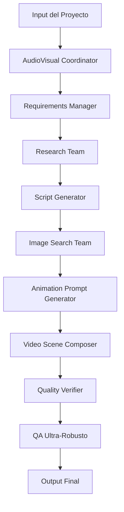

# 🎬 Guía del Sistema Audiovisual - Framework Silhouette V4.0

## 📋 Resumen del Sistema

El Sistema Audiovisual del Framework Silhouette V4.0 es un ecosistema completo de 15+ equipos especializados en producción multimedia profesional. Diseñado para automatizar desde la conceptualización hasta la entrega final de contenido audiovisual de alta calidad.

### 🎯 Características Principales

- ✅ **Búsqueda Automática de Assets** - Imágenes libres de licencia
- ✅ **Generación de Guiones Virales** - Guiones optimizados para engagement
- ✅ **Prompts de Animación IA** - Para Runway, Pika, Luma AI
- ✅ **Composición de Escenas** - Ensamblaje inteligente de video
- ✅ **QA Ultra-Robusto** - 99.99% tasa de calidad
- ✅ **Multi-Plataforma** - Optimización para diferentes redes sociales
- ✅ **Prevención de Alucinaciones** - Verificación multi-fuente

## 🏗️ Arquitectura del Sistema Audiovisual

### Equipos Especializados

| Equipo | Puerto | Función Principal | Tecnología |
|--------|--------|-------------------|------------|
| `audiovisual-team` | 8000 | Coordinador principal | Python |
| `animation-prompt-generator` | 8065 | Generación de prompts IA | Node.js |
| `audiovisual-coordinator` | 8066 | Coordinación de equipos | Python |
| `prompt-execution-engine` | 8067 | Ejecución de prompts | Node.js |
| `image-search-team` | 8068 | Búsqueda de imágenes | Python |
| `image-quality-verifier` | 8069 | Verificación de calidad | Python |
| `audiovisual-integration` | 8070 | Integración de sistemas | Python |
| `audiovisual-research` | 8071 | Investigación de tendencias | Python |
| `video-scene-composer` | 8072 | Composición de escenas | Python |
| `professional-script-generator` | 8073 | Guiones profesionales | Python |
| `video-strategy-planner` | 8074 | Planificación estratégica | Python |
| `requirements-manager` | 8075 | Gestión de requerimientos | Python |

### Flujo de Producción



## 🚀 Inicio Rápido

### Instalación y Configuración

```bash
# Navegar al directorio del sistema audiovisual
cd /workspace/framework_clean/audiovisual-team

# Instalar dependencias
pip install -r requirements.txt

# Configurar variables de entorno
cp .env.example .env
# Editar .env con tus API keys (usar placeholders)

# Iniciar el coordinador principal
python main.py
```

### Primer Proyecto

```python
from coordinator import AudioVisualTeamCoordinator

# Inicializar coordinador
coordinator = AudioVisualTeamCoordinator()

# Definir proyecto
proyecto = {
    "titulo": "Video sobre IA en Marketing",
    "plataforma": "Instagram Reels",
    "duracion": 30,
    "audiencia": "Marketers 25-40 años",
    "objetivo": "engagement_y_educacion",
    "recursos": {
        "buscar_imagenes": True,
        "generar_guion": True,
        "crear_prompts_animacion": True,
        "verificar_calidad": True
    }
}

# Ejecutar proyecto
resultado = await coordinator.ejecutar_proyecto_completo(proyecto)

print("📹 Video final:", resultado.video_url)
print("✅ QA Score:", resultado.qa_score)
print("📊 Predicción engagement:", resultado.predicted_engagement)
```

## 📖 Equipos Detallados

### 1. AudioVisual Coordinator (Puerto 8000)

**Función:** Coordinador principal que orquesta todos los equipos audiovisuales.

```python
# audiovisual-team/main.py
class AudioVisualTeamCoordinator:
    def __init__(self):
        self.teams = {
            'script_generator': ScriptGeneratorTeam(),
            'image_search': ImageSearchTeam(),
            'animation_prompts': AnimationPromptsTeam(),
            'video_composer': VideoComposerTeam(),
            'quality_verifier': QualityVerifierTeam()
        }
        self.qa_system = QASystem()
    
    async def ejecutar_proyecto_completo(self, proyecto):
        # Pipeline completo de producción
        script = await self.teams['script_generator'].generar_guion(proyecto)
        images = await self.teams['image_search'].buscar_imagenes(script)
        animation_prompts = await self.teams['animation_prompts'].crear_prompts(script)
        video = await self.teams['video_composer'].componer_video(
            images, animation_prompts, proyecto
        )
        
        # QA ultra-robusto
        qa_result = await self.qa_system.validar_completo(video, script, images)
        
        return {
            "video_url": video,
            "qa_score": qa_result.score,
            "engagement_prediction": qa_result.prediction,
            "assets_generated": {
                "script": script,
                "images": images,
                "animation_prompts": animation_prompts
            }
        }
```

### 2. Animation Prompt Generator (Puerto 8065)

**Función:** Genera prompts optimizados para herramientas de IA de animación.

```javascript
// animation-prompt-generator/index.js
class AnimationPromptGenerator {
    constructor() {
        this.providers = {
            'runway': new RunwayAIProvider(),
            'pika': new PikaAIProvider(),
            'luma': new LumaAIProvider()
        };
    }
    
    async generatePrompts(script, options = {}) {
        const prompts = {
            runway: [],
            pika: [],
            luma: []
        };
        
        // Analizar script para identificar escenas
        const scenes = await this.analyzeScript(script);
        
        for (const scene of scenes) {
            // Generar prompts por proveedor
            prompts.runway.push(await this.createRunwayPrompt(scene));
            prompts.pika.push(await this.createPikaPrompt(scene));
            prompts.luma.push(await this.createLumaPrompt(scene));
        }
        
        return prompts;
    }
    
    async createRunwayPrompt(scene) {
        return {
            prompt: this.optimizeForRunway(scene.description),
            seed: this.generateSeed(),
            guidance_scale: 7.5,
            num_inference_steps: 25,
            duration: scene.duration
        };
    }
    
    optimizeForRunway(description) {
        // Optimizaciones específicas para Runway
        return `${description}, high quality, cinematic, professional, 4k, smooth animation`;
    }
}
```

### 3. Image Search Team (Puerto 8068)

**Función:** Búsqueda y descarga automática de imágenes libres de licencia.

```python
# image-search-team/image_searcher.py
class ImageSearchTeam:
    def __init__(self):
        self.providers = [
            UnsplashProvider(),
            PexelsProvider(),
            PixabayProvider()
        ]
        self.quality_filter = QualityFilter()
        self.license_checker = LicenseChecker()
    
    async def buscar_imagenes(self, script, criterios):
        # Extraer palabras clave del script
        keywords = self.extract_keywords(script)
        
        # Buscar en múltiples proveedores
        images = []
        for provider in self.providers:
            results = await provider.search(
                keywords=keywords,
                min_quality=90,
                orientation="landscape",
                count=criterios.get('count', 10)
            )
            images.extend(results)
        
        # Filtrar por calidad y licencia
        filtered_images = await self.quality_filter.filter(images)
        licensed_images = await self.license_checker.verify(filtered_images)
        
        return licensed_images
    
    def extract_keywords(self, script):
        # NLP para extraer palabras clave relevantes
        import spacy
        nlp = spacy.load("en_core_web_sm")
        doc = nlp(script)
        
        keywords = []
        for token in doc:
            if token.pos_ in ['NOUN', 'ADJ'] and not token.is_stop:
                keywords.append(token.lemma_)
        
        return keywords[:20]  # Top 20 keywords
```

### 4. Professional Script Generator (Puerto 8073)

**Función:** Genera guiones optimizados para diferentes plataformas y audiencias.

```python
# script-generator/script_generator.py
class ProfessionalScriptGenerator:
    def __init__(self):
        self.template_engine = TemplateEngine()
        self.viral_analyzer = ViralContentAnalyzer()
        self.platform_optimizer = PlatformOptimizer()
    
    async def generar_guion(self, proyecto):
        # Seleccionar template según plataforma
        template = await self.template_engine.select_template(
            platform=proyecto.plataforma,
            objetivo=proyecto.objetivo,
            duracion=proyecto.duracion
        )
        
        # Generar contenido base
        contenido = await self.generate_base_content(proyecto, template)
        
        # Optimizar para viralización
        viral_content = await self.viral_analyzer.optimize(contenido)
        
        # Optimizar para plataforma específica
        final_script = await self.platform_optimizer.optimize(
            viral_content, proyecto.plataforma
        )
        
        return {
            "script": final_script,
            "hooks": self.extract_hooks(final_script),
            "cta": self.extract_cta(final_script),
            "duration_estimate": self.estimate_duration(final_script)
        }
    
    async def generate_base_content(self, proyecto, template):
        # Ejemplo de template para Instagram Reels
        if proyecto.plataforma == "Instagram Reels":
            return {
                "hook": f"¿Sabías que {proyecto.tema} está revolucionando {proyecto.industria}?",
                "intro": "En este video te explico cómo...",
                "body": await self.generate_body_content(proyecto),
                "cta": "¡Sígueme para más contenido como este! 👆",
                "hashtags": await self.generate_hashtags(proyecto)
            }
```

### 5. Video Scene Composer (Puerto 8072)

**Función:** Composición inteligente de escenas de video.

```python
# video-composer/scene_composer.py
class VideoSceneComposer:
    def __init__(self):
        self.scene_analyzer = SceneAnalyzer()
        self.transition_engine = TransitionEngine()
        self.timing_optimizer = TimingOptimizer()
    
    async def componer_video(self, images, animation_prompts, proyecto):
        # Analizar imágenes para composición
        scenes = await self.scene_analyzer.analyze_sequence(images)
        
        # Crear timeline
        timeline = await self.create_timeline(scenes, proyecto.duracion)
        
        # Aplicar transiciones
        composed_timeline = await self.transition_engine.apply_transitions(timeline)
        
        # Optimizar timing
        final_timeline = await self.timing_optimizer.optimize(composed_timeline)
        
        return {
            "timeline": final_timeline,
            "render_settings": await self.get_render_settings(proyecto),
            "export_format": await self.get_optimal_format(proyecto.plataforma)
        }
    
    async def create_timeline(self, scenes, total_duration):
        timeline = []
        scene_duration = total_duration / len(scenes)
        
        for i, scene in enumerate(scenes):
            timeline.append({
                "scene_id": i,
                "start_time": i * scene_duration,
                "end_time": (i + 1) * scene_duration,
                "duration": scene_duration,
                "assets": scene.images,
                "effects": scene.effects,
                "audio_timing": scene.audio_markers
            })
        
        return timeline
```

## 🔧 Configuración Avanzada

### Variables de Entorno

```bash
# API Keys (usar placeholders)
UNSPLASH_ACCESS_KEY=your_unsplash_key_here
PEXELS_API_KEY=your_pexels_key_here
PIXABAY_API_KEY=your_pixabay_key_here

# AI Animation Providers (usar placeholders)
RUNWAY_API_KEY=your_runway_key_here
PIKA_API_KEY=your_pika_key_here
LUMA_API_KEY=your_luma_key_here

# Audio AI (usar placeholders)
ELEVENLABS_API_KEY=your_elevenlabs_key_here
OPENAI_API_KEY=your_openai_key_here

# Configuración del sistema
MAX_CONCURRENT_PROJECTS=10
QUALITY_THRESHOLD=90
RENDER_QUALITY=4K
DEFAULT_DURATION=30
DEFAULT_FPS=30

# QA Configuration
QA_STRICT_MODE=true
MIN_QA_SCORE=85
AUTO_RETRY_FAILED=true
MAX_RETRY_ATTEMPTS=3

# Storage
ASSET_STORAGE_PATH=./assets
CACHE_ENABLED=true
CACHE_TTL=3600
```

### Configuración de Calidad

```python
# config/quality_config.py
QUALITY_PRESETS = {
    "youtube": {
        "resolution": "1920x1080",
        "fps": 30,
        "bitrate": "8000k",
        "codec": "h264",
        "quality_threshold": 85
    },
    "instagram_reels": {
        "resolution": "1080x1920",
        "fps": 30,
        "bitrate": "3500k",
        "codec": "h264",
        "quality_threshold": 90
    },
    "tiktok": {
        "resolution": "1080x1920",
        "fps": 30,
        "bitrate": "2500k",
        "codec": "h264",
        "quality_threshold": 88
    }
}
```

## 📊 Métricas y Optimización

### Métricas del Sistema Audiovisual

```python
# metrics/audiovisual_metrics.py
class AudioVisualMetrics:
    def __init__(self):
        self.performance_tracker = PerformanceTracker()
        self.quality_analyzer = QualityAnalyzer()
        self.engagement_predictor = EngagementPredictor()
    
    async def track_project_metrics(self, proyecto, resultado):
        metrics = {
            "execution_time": resultado.execution_time,
            "quality_score": resultado.qa_score,
            "assets_used": len(resultado.assets_generated),
            "platform_compliance": await self.check_platform_compliance(
                resultado, proyecto.plataforma
            ),
            "predicted_engagement": await self.engagement_predictor.predict(
                resultado, proyecto.audiencia
            ),
            "cost_per_minute": resultado.total_cost / proyecto.duracion
        }
        
        await self.performance_tracker.record(metrics)
        return metrics
```

### Optimización Automática

```javascript
// optimization/audiovisual_optimizer.js
class AudioVisualOptimizer {
    constructor() {
        this.ml_engine = new MachineLearningEngine();
        this.performance_history = [];
    }
    
    async optimizeNextProject(previous_projects) {
        const patterns = await this.analyzePerformance(previous_projects);
        const optimizations = await this.ml_engine.predict(patterns);
        
        return {
            suggested_timing: optimizations.timing,
            recommended_transitions: optimizations.transitions,
            optimal_asset_types: optimizations.assets,
            platform_specific_tweaks: optimizations.platforms
        };
    }
}
```

## 🎯 Casos de Uso Específicos

### 1. Marketing de Producto

```python
# Ejemplo: Video promocional para nuevo producto
proyecto_marketing = {
    "tipo": "product_launch",
    "producto": "App de Productividad",
    "plataforma": "Instagram Reels",
    "audiencia": "Profesionales 25-45 años",
    "duracion": 30,
    "objetivo": "app_downloads",
    "recursos": {
        "screenshots_app": True,
        "testimonios": True,
        "call_to_action": "Descargar ahora",
        "branding": "corporativo"
    }
}
```

### 2. Contenido Educativo

```python
# Ejemplo: Tutorial técnico
proyecto_educativo = {
    "tipo": "educational",
    "tema": "Machine Learning para principiantes",
    "plataforma": "YouTube Shorts",
    "audiencia": "Estudiantes y profesionales",
    "duracion": 60,
    "objetivo": "educacion_y_suscripciones",
    "recursos": {
        "diagramas": True,
        "code_examples": True,
        "animations": True,
        "branding": "educativo"
    }
}
```

### 3. Contenido Viral

```python
# Ejemplo: Contenido para trends
proyecto_viral = {
    "tipo": "viral_trend",
    "tema": "IA en 2025",
    "plataforma": "TikTok",
    "audiencia": "Gen Z",
    "duracion": 15,
    "objetivo": "viralidad_maxima",
    "recursos": {
        "trending_sounds": True,
        "effects": True,
        "hashtag_optimization": True,
        "engagement_hooks": True
    }
}
```

## 🔍 QA Ultra-Robusto

### Sistema de Validación

```python
# qa/ultra_robusto_system.py
class QASystem:
    def __init__(self):
        self.content_validator = ContentValidator()
        self.quality_analyzer = QualityAnalyzer()
        self.brand_checker = BrandComplianceChecker()
        self.platform_compliance = PlatformComplianceChecker()
    
    async def validar_completo(self, video, script, images):
        validations = {
            "content_quality": await self.content_validator.validate(script),
            "visual_quality": await self.quality_analyzer.analyze(video, images),
            "brand_compliance": await self.brand_checker.check(video, script),
            "platform_compliance": await self.platform_compliance.validate(video),
            "technical_quality": await self.technical_quality_check(video)
        }
        
        # Calcular score general
        general_score = self.calculate_overall_score(validations)
        
        # Generar recomendaciones
        recommendations = await self.generate_recommendations(validations)
        
        return {
            "score": general_score,
            "validations": validations,
            "recommendations": recommendations,
            "approved": general_score >= 90,
            "estimated_performance": await self.predict_performance(validations)
        }
```

## 🚀 Deployment y Escalabilidad

### Docker Configuration

```dockerfile
# Dockerfile.audiovisual
FROM python:3.9-slim

WORKDIR /app

# Instalar dependencias
COPY requirements.txt .
RUN pip install -r requirements.txt

# Instalar FFmpeg para procesamiento de video
RUN apt-get update && apt-get install -y ffmpeg

# Copiar código fuente
COPY . .

# Variables de entorno
ENV PYTHONPATH=/app
ENV PORT=8000

EXPOSE 8000

CMD ["python", "main.py"]
```

### Kubernetes Deployment

```yaml
# k8s/audiovisual-deployment.yaml
apiVersion: apps/v1
kind: Deployment
metadata:
  name: audiovisual-team
spec:
  replicas: 3
  selector:
    matchLabels:
      app: audiovisual-team
  template:
    metadata:
      labels:
        app: audiovisual-team
    spec:
      containers:
      - name: audiovisual
        image: silhouette/audiovisual:4.0
        ports:
        - containerPort: 8000
        env:
        - name: QUALITY_THRESHOLD
          value: "90"
        - name: MAX_CONCURRENT_PROJECTS
          value: "10"
        resources:
          requests:
            memory: "2Gi"
            cpu: "1000m"
          limits:
            memory: "4Gi"
            cpu: "2000m"
```

## 📚 Referencias y Recursos

### APIs de Terceros

- **Unsplash API:** Búsqueda de imágenes
- **Pexels API:** Imágenes y videos
- **Pixabay API:** Assets libres
- **Runway ML API:** Animación IA
- **Pika Labs API:** Generación de video
- **Luma AI API:** Composición de escenas

### Documentación Adicional

- [📖 Documentación Técnica Completa](./TECHNICAL_DOCUMENTATION.md)
- [⚡ Guía de Optimización](./OPTIMIZATION_GUIDE.md)
- [🔧 Guía de Integración](./INTEGRATION_GUIDE.md)
- [📊 API Reference](./API_REFERENCE.md)

---

El Sistema Audiovisual del Framework Silhouette V4.0 representa la culminación de años de desarrollo en automatización de producción multimedia, combinando lo mejor de la IA generativa con procesos empresariales robustos y escalables.
