# Plan de Integración: Sistema Multiagente Unificado para Apps de Agentes IA
## Iris, Silhouette y Ecosistema Completo

**Autor:** Silhouette Anónimo  
**Fecha:** 08-Nov-2025  
**Versión:** 1.0 - Integración Multi-App  
**Objetivo:** Unificar Iris, Silhouette y todas las apps de agentes IA bajo un sistema multiagente jerárquico común

---

## 🎯 Visión Unificada: Un Sistema, Múltiples Aplicaciones

### 1.1 El Problema Actual
Cada aplicación de agentes IA (Iris, Silhouette, etc.) opera de forma aislada:
- Equipos duplicados
- Memoria fragmentada
- Coordinación ineficiente
- Costos operacionales altos
- Escalabilidad limitada

### 1.2 La Solución Unificada
**Un Sistema Multiagente Jerárquico Centralizado** que sirve a todas las aplicaciones:
- **Equipos compartidos** pero con aislamiento por tenant
- **Memoria unificada** con segregación multi-tenant
- **Coordinación eficiente** entre todas las aplicaciones
- **Costos optimizados** por economías de escala
- **Escalabilidad infinita** con arquitectura centralizada

---

## 🏗️ Arquitectura de Integración Multi-App

### 2.1 Vista General del Ecosistema

```mermaid
graph TB
    subgraph "Aplicaciones Cliente"
        IRIS[Iris<br/>👁️ Asistente Visual AI]
        SIL[Silhouette<br/>🎨 Diseño Inteligente]
        NWC[NWC<br/>💼 Workflows Empresariales]
        MED[MedLuxe<br/>⚕️ Healthcare AI]
        BRA[Brandistry<br/>🏷️ Branding AI]
    end
    
    subgraph "Gateway Multi-Tenant"
        GW[API Gateway<br/>🔐 Autenticación por App]
        MCP[MCP Server<br/>🛠️ Catálogo Unificado]
    end
    
    subgraph "Sistema Multiagente Central"
        ORQ[Orquestador Universal<br/>🎭 Coordinador de Apps]
        PLAN[Planificador Multi-App<br/>🧭 Gestor de Tareas]
        CTX[Contexto Compartido<br/>📚 Memoria Unificada]
        NOTI[Notificaciones<br/>📢 Sistema de Alertas]
    end
    
    subgraph "Equipos Especializados por App"
        IRIS_TEAM[Equipo Iris<br/>👁️ Visión Computacional]
        SIL_TEAM[Equipo Silhouette<br/>🎨 Diseño Generativo]
        NWC_TEAM[Equipo NWC<br/>💼 Automatización]
        MED_TEAM[Equipo MedLuxe<br/>⚕️ Diagnóstico AI]
        BRA_TEAM[Equipo Brandistry<br/>🏷️ Creatividad AI]
    end
    
    subgraph "Memoria Multi-Tenant"
        DB[(PostgreSQL<br/>📊 Datos por Tenant)]
        VEC[(VectorDB<br/>🧠 Conocimiento por App)]
        GRAPH[(GraphDB<br/>🕸️ Relaciones Multi-App)]
    end
    
    IRIS --> GW --> ORQ
    SIL --> GW --> ORQ
    NWC --> GW --> ORQ
    MED --> GW --> ORQ
    BRA --> GW --> ORQ
    
    GW --> MCP
    ORQ --> PLAN --> CTX
    CTX --> NOTI
    
    PLAN --> IRIS_TEAM
    PLAN --> SIL_TEAM
    PLAN --> NWC_TEAM
    PLAN --> MED_TEAM
    PLAN --> BRA_TEAM
    
    CTX --> DB
    CTX --> VEC
    CTX --> GRAPH
```



### 2.2 Modelo Multi-Tenant por Aplicación

```yaml
Tenant_Configuration:
  iris:
    tenant_id: "tenant_iris_v1"
    app_id: "iris_visual_ai"
    capabilities: ["computer_vision", "image_analysis", "visual_reasoning"]
    team_specialization: "vision_computational"
    models: 
      primary: "gpt-4-vision"
      secondary: "claude-3-vision"
    tools: ["mcp.image_analyzer", "mcp.object_detector", "mcp.style_transfer"]
    quotas:
      requests_per_hour: 10000
      storage_gb: 100
      compute_units: 1000
  
  silhouette:
    tenant_id: "tenant_silhouette_v1"
    app_id: "silhouette_design_ai"
    capabilities: ["design_generation", "creative_writing", "brand_development"]
    team_specialization: "creative_design"
    models:
      primary: "gpt-4o"
      creative: "dall-e-3"
    tools: ["mcp.design_generator", "mcp.brand_analyzer", "mcp.creative_writer"]
    quotas:
      requests_per_hour: 5000
      storage_gb: 50
      compute_units: 800
  
  nwc:
    tenant_id: "tenant_nwc_v1"
    app_id: "nwc_workflow_ai"
    capabilities: ["workflow_automation", "process_optimization", "data_analysis"]
    team_specialization: "business_automation"
    models:
      primary: "gpt-4o"
      analysis: "claude-3-sonnet"
    tools: ["mcp.workflow_engine", "mcp.data_analyzer", "mcp.process_optimizer"]
    quotas:
      requests_per_hour: 15000
      storage_gb: 200
      compute_units: 1200
```

---

## 🔌 APIs de Integración por Aplicación

### 3.1 API Unificada para Todas las Apps

#### 3.1.1 Endpoints Principales

```typescript
// API Unificada Multi-Tenant
interface UnifiedAPI {
  // Detección de Intención por App
  detectIntent(params: {
    app_id: 'iris' | 'silhouette' | 'nwc' | 'medluxe' | 'brandistry';
    tenant_id: string;
    user_input: string;
    context?: any;
  }): Promise<IntentResponse>;
  
  // Creación de Plan Multi-App
  createPlan(params: {
    app_id: string;
    tenant_id: string;
    objective: string;
    capabilities_needed: string[];
  }): Promise<PlanResponse>;
  
  // Ejecución de Tareas por App
  executeTask(params: {
    app_id: string;
    tenant_id: string;
    task_id: string;
    inputs: any;
  }): Promise<TaskResult>;
  
  // Gestión de Contexto Compartido
  updateContext(params: {
    app_id: string;
    tenant_id: string;
    context_type: 'user' | 'project' | 'session';
    data: any;
  }): Promise<ContextUpdate>;
}
```

#### 3.1.2 SDKs Específicos por Aplicación

**SDK para Iris:**
```typescript
import { IrisMultiAgentSDK } from '@haas/iris-sdk';

const iris = new IrisMultiAgentSDK({
  apiKey: process.env.IRIS_API_KEY,
  tenantId: 'tenant_iris_v1',
  endpoint: 'https://haas-platform.com/api'
});

// Capacidades específicas de Iris
await iris.analyzeImage({
  imageUrl: 'https://example.com/image.jpg',
  analysisType: 'comprehensive', // visual, objects, style, context
  generateInsights: true,
  createWorkflow: false
});

await iris.generateVisualContent({
  prompt: 'Diseño minimalista para app de salud',
  style: 'medical_professional',
  outputFormat: 'png',
  variations: 5
});
```

**SDK para Silhouette:**
```typescript
import { SilhouetteMultiAgentSDK } from '@haas/silhouette-sdk';

const silhouette = new SilhouetteMultiAgentSDK({
  apiKey: process.env.SILHOUETTE_API_KEY,
  tenantId: 'tenant_silhouette_v1',
  endpoint: 'https://haas-platform.com/api'
});

// Capacidades específicas de Silhouette
await silhouette.createDesignSystem({
  brand: 'TechCorp',
  industry: 'technology',
  targetAudience: 'professionals',
  style: 'modern_minimalist',
  colorPalette: ['#1a1a1a', '#ffffff', '#0066cc'],
  typography: 'inter'
});

await silhouette.generateBrandAssets({
  brandName: 'InnovateCorp',
  tagline: 'Innovation Redefined',
  logoStyle: 'abstract_geometric',
  businessType: 'technology_startup'
});
```

**SDK para NWC:**
```typescript
import { NWCMultiAgentSDK } from '@haas/nwc-sdk';

const nwc = new NWCMultiAgentSDK({
  apiKey: process.env.NWC_API_KEY,
  tenantId: 'tenant_nwc_v1',
  endpoint: 'https://haas-platform.com/api'
});

// Capacidades específicas de NWC
await nwc.optimizeWorkflow({
  processId: 'customer_onboarding',
  bottlenecks: ['approval_step', 'document_verification'],
  performanceMetrics: ['time_to_complete', 'error_rate'],
  optimizationGoal: 'reduce_completion_time'
});

await nwc.automateTask({
  taskType: 'data_entry',
  inputSource: 'email_parser',
  outputDestination: 'crm_system',
  validationRules: ['email_format', 'required_fields']
});
```

---

## 🧠 Gestión de Contexto Multi-Aplicación

### 4.1 Modelo de Memoria Compartida con Aislamiento

```sql
-- Tabla de contexto multi-tenant
CREATE TABLE unified_context (
  id UUID PRIMARY KEY DEFAULT gen_random_uuid(),
  tenant_id TEXT NOT NULL,
  app_id TEXT NOT NULL,
  user_id TEXT,
  session_id TEXT,
  context_type TEXT NOT NULL, -- 'user', 'project', 'task', 'conversation'
  context_key TEXT NOT NULL,
  context_value JSONB NOT NULL,
  metadata JSONB DEFAULT '{}',
  created_at TIMESTAMPTZ DEFAULT NOW(),
  updated_at TIMESTAMPTZ DEFAULT NOW(),
  expires_at TIMESTAMPTZ,
  -- Índices para optimización
  INDEX idx_tenant_app (tenant_id, app_id),
  INDEX idx_user_session (user_id, session_id),
  INDEX idx_type_key (context_type, context_key),
  INDEX idx_expiry (expires_at)
);

-- Tabla de conocimiento compartido (RAG)
CREATE TABLE shared_knowledge (
  id UUID PRIMARY KEY DEFAULT gen_random_uuid(),
  tenant_id TEXT NOT NULL,
  app_id TEXT NOT NULL,
  knowledge_type TEXT NOT NULL, -- 'user_preference', 'app_capability', 'workflow_template'
  title TEXT NOT NULL,
  content TEXT NOT NULL,
  embedding VECTOR(1536), -- OpenAI embedding dimension
  tags TEXT[],
  source TEXT, -- 'user', 'system', 'imported'
  confidence_score FLOAT DEFAULT 1.0,
  usage_count INTEGER DEFAULT 0,
  created_at TIMESTAMPTZ DEFAULT NOW(),
  updated_at TIMESTAMPTZ DEFAULT NOW(),
  -- Índices para búsqueda semántica
  INDEX idx_tenant_app_knowledge (tenant_id, app_id, knowledge_type),
  INDEX idx_embedding USING ivfflat (embedding vector_cosine_ops),
  INDEX idx_tags (tags)
);

-- Tabla de workflows compartidos
CREATE TABLE shared_workflows (
  id UUID PRIMARY KEY DEFAULT gen_random_uuid(),
  tenant_id TEXT NOT NULL,
  source_app_id TEXT NOT NULL,
  target_app_id TEXT NOT NULL,
  workflow_name TEXT NOT NULL,
  workflow_definition JSONB NOT NULL,
  input_schema JSONB,
  output_schema JSONB,
  tags TEXT[],
  is_public BOOLEAN DEFAULT FALSE,
  usage_count INTEGER DEFAULT 0,
  success_rate FLOAT DEFAULT 1.0,
  created_at TIMESTAMPTZ DEFAULT NOW(),
  updated_at TIMESTAMPTZ DEFAULT NOW(),
  -- Índices
  INDEX idx_apps_workflow (source_app_id, target_app_id, workflow_name),
  INDEX idx_public_workflows (is_public, target_app_id)
);
```

### 4.2 Ejemplo de Contexto Compartido

```json
{
  "context_id": "ctx_user_123_iris_silhouette",
  "tenant_id": "tenant_premium",
  "app_id": "unified_user",
  "user_id": "user_123",
  "context_type": "user_preference",
  "context_data": {
    "design_preferences": {
      "iris": {
        "visual_style": "minimalist_medical",
        "color_scheme": ["#ffffff", "#0066cc", "#f8f9fa"],
        "interface_density": "comfortable"
      },
      "silhouette": {
        "design_style": "modern_professional",
        "brand_personality": "innovative_trustworthy",
        "industry_focus": "healthcare_technology"
      }
    },
    "workflow_preferences": {
      "cross_app_workflows": true,
      "preferred_automation_level": "supervised",
      "notification_preferences": {
        "email": true,
        "in_app": true,
        "push": false
      }
    }
  },
  "metadata": {
    "last_active": "2025-11-08T16:53:08Z",
    "total_sessions": 156,
    "app_usage": {
      "iris": 0.4,
      "silhouette": 0.3,
      "nwc": 0.2,
      "other": 0.1
    }
  }
}
```

---

## 🔄 Workflows Cross-Aplicación

### 5.1 Flujos de Trabajo Unificados

#### 5.1.1 Workflow: "De Idea a Producto Completo"

```yaml
workflow_name: "idea_to_full_product"
description: "Workflow completo desde idea inicial hasta producto desplegado"
apps_involved: ["silhouette", "nwc", "iris"]
estimated_duration: "2-4 horas"

steps:
  1:
    app: "silhouette"
    task: "concept_design"
    description: "Crear concepto visual y branding inicial"
    inputs:
      - idea_description
      - target_audience
      - industry
    outputs:
      - brand_identity
      - design_concept
      - color_palette
    estimated_time: "30 minutos"
  
  2:
    app: "iris"
    task: "visual_validation"
    description: "Validar diseño con análisis visual y UX"
    inputs:
      - design_concept
      - brand_identity
    outputs:
      - ux_analysis
      - visual_recommendations
      - accessibility_score
    estimated_time: "15 minutos"
  
  3:
    app: "nwc"
    task: "workflow_automation"
    description: "Crear workflows y procesos automatizados"
    inputs:
      - brand_identity
      - ux_analysis
      - business_requirements
    outputs:
      - automated_workflows
      - process_documentation
      - integration_specs
    estimated_time: "60 minutos"
  
  4:
    app: "silhouette"
    task: "final_design_refinement"
    description: "Refinamiento final basado en análisis de Iris y workflows de NWC"
    inputs:
      - initial_design
      - ux_analysis
      - workflow_requirements
    outputs:
      - final_brand_package
      - design_system
      - implementation_guide
    estimated_time: "30 minutos"
```

#### 5.1.2 Workflow: "Diagnóstico y Solución Integral"

```yaml
workflow_name: "diagnostic_to_solution"
description: "Workflow para problemas complejos que requieren múltiples apps"
apps_involved: ["iris", "medluxe", "nwc"]
estimated_duration: "1-3 horas"

steps:
  1:
    app: "iris"
    task: "visual_diagnosis"
    description: "Análisis visual de documentos médicos, imágenes, etc."
    inputs:
      - medical_images
      - diagnostic_photos
      - patient_data
    outputs:
      - visual_findings
      - image_analysis
      - preliminary_assessment
    estimated_time: "20 minutos"
  
  2:
    app: "medluxe"
    task: "clinical_analysis"
    description: "Análisis clínico profundo basado en hallazgos visuales"
    inputs:
      - visual_findings
      - medical_history
      - lab_results
    outputs:
      - clinical_assessment
      - diagnosis_suggestions
      - treatment_recommendations
    estimated_time: "30 minutos"
  
  3:
    app: "nwc"
    task: "care_coordination"
    description: "Crear plan de cuidado automatizado y coordinación"
    inputs:
      - clinical_assessment
      - treatment_recommendations
      - patient_schedule
    outputs:
      - care_workflow
      - appointment_scheduling
      - follow_up_plan
    estimated_time: "25 minutos"
```

---

## 📊 Dashboard Unificado Multi-App

### 6.1 Panel de Control Central

```typescript
interface UnifiedDashboard {
  // Vista general de todas las apps
  getUnifiedOverview(): Promise<{
    activeUsers: number;
    totalRequests: number;
    appBreakdown: AppUsageStats[];
    systemHealth: SystemHealth;
  }>;
  
  // Métricas por aplicación
  getAppMetrics(appId: string, timeframe: string): Promise<AppMetrics>;
  
  // Workflows cross-app en ejecución
  getActiveWorkflows(): Promise<ActiveWorkflow[]>;
  
  // Recursos compartidos
  getResourceUtilization(): Promise<ResourceStats>;
}

interface AppUsageStats {
  appId: string;
  appName: string;
  activeUsers: number;
  requestsPerHour: number;
  avgResponseTime: number;
  successRate: number;
  topWorkflows: WorkflowUsage[];
}

interface ActiveWorkflow {
  workflowId: string;
  workflowName: string;
  involvedApps: string[];
  currentStep: number;
  totalSteps: number;
  progress: number;
  estimatedCompletion: string;
  status: 'running' | 'paused' | 'completed' | 'error';
}
```

### 6.2 Componentes de UI Unificados

```jsx
// Dashboard Principal
const UnifiedDashboard = () => {
  return (
    <div className="unified-dashboard">
      <header>
        <h1>Multi-Agent Platform Control Center</h1>
        <app-switcher apps={['iris', 'silhouette', 'nwc', 'medluxe', 'brandistry']} />
      </header>
      
      <div className="dashboard-grid">
        <AppUsagePanel />
        <SystemHealthPanel />
        <ActiveWorkflowsPanel />
        <ResourceUtilizationPanel />
        <CrossAppWorkflowsPanel />
      </div>
    </div>
  );
};

// Panel de Workflows Cross-App
const CrossAppWorkflows = () => {
  const [workflows, setWorkflows] = useState([]);
  
  return (
    <div className="cross-app-workflows">
      <h3>Workflows Multi-Aplicación</h3>
      <workflow-timeline workflows={workflows} />
      <cross-app-metrics />
    </div>
  );
};
```

---

## 🛡️ Seguridad y Aislamiento Multi-Tenant

### 7.1 Arquitectura de Seguridad

```yaml
Security_Architecture:
  Multi_Tenant_Isolation:
    Database_Level:
      RLS: "Row Level Security por tenant_id"
      Schema_Per_Tenant: false  # Compartir esquema con RLS
      Connection_Pooling: "Por tenant con timeouts"
    
    Application_Level:
      JWT_Tokens: "Claims incluyen tenant_id y app_id"
      API_Gateway: "Rate limiting por tenant"
      Context_Isolation: "Filtros automáticos por tenant"
  
  Authentication:
    Methods:
      - "JWT con claims personalizados"
      - "API Keys por aplicación"
      - "OAuth 2.0 para integración"
      - "mTLS para servicios internos"
    
    Claims_Structure:
      tenant_id: "string (requerido)"
      app_id: "string (requerido)"
      user_id: "string (opcional)"
      roles: "array de strings"
      permissions: "array de permisos específicos"
      expires_at: "timestamp"
  
  Authorization:
    RBAC: "Role-Based Access Control"
    ABAC: "Attribute-Based Access Control (opcional)"
    Dynamic_Permissions: "Permisos por contexto"
```

### 7.2 Configuración de Seguridad por App

```typescript
// Configuración de seguridad para cada app
const appSecurityConfig = {
  iris: {
    tenantId: 'tenant_iris_v1',
    allowedCapabilities: ['computer_vision', 'image_analysis'],
    maxConcurrentRequests: 100,
    rateLimitPerHour: 10000,
    allowedIPRanges: ['192.168.1.0/24', '10.0.0.0/8'],
    encryptionLevel: 'AES-256',
    auditLogLevel: 'detailed'
  },
  
  silhouette: {
    tenantId: 'tenant_silhouette_v1',
    allowedCapabilities: ['design_generation', 'brand_development'],
    maxConcurrentRequests: 50,
    rateLimitPerHour: 5000,
    allowedIPRanges: ['*'],  # Acceso público controlado
    encryptionLevel: 'AES-256',
    auditLogLevel: 'standard'
  },
  
  nwc: {
    tenantId: 'tenant_nwc_v1',
    allowedCapabilities: ['workflow_automation', 'process_optimization'],
    maxConcurrentRequests: 200,
    rateLimitPerHour: 15000,
    allowedIPRanges: ['192.168.100.0/24'],
    encryptionLevel: 'AES-256-GCM',
    auditLogLevel: 'comprehensive',
    complianceRequirements: ['SOC2', 'GDPR']
  }
};
```

---

## 🚀 Plan de Migración y Despliegue

### 8.1 Fases de Migración

#### Fase 1: Infraestructura Base (Semana 1-2)
```yaml
Objetivos:
  - Desplegar sistema multiagente central
  - Configurar base de datos multi-tenant
  - Implementar gateway de APIs
  - Crear equipos especializados básicos

Entregables:
  - API Gateway funcionando
  - Base de datos con RLS
  - Sistema de autenticación unificado
  - Documentación de APIs
```

#### Fase 2: Integración de Iris (Semana 3-4)
```yaml
Objetivos:
  - Migrar capacidades de Iris al sistema central
  - Crear SDK específico para Iris
  - Migrar datos de usuarios existentes
  - Testing exhaustivo de integración

Entregables:
  - SDK de Iris completamente funcional
  - Migración de datos de usuarios
  - Capacidades de visión computacional centralizadas
  - Dashboard de métricas de Iris
```

#### Fase 3: Integración de Silhouette (Semana 5-6)
```yaml
Objetivos:
  - Migrar capacidades de diseño de Silhouette
  - Integrar con sistema de memoria de Iris para workflows
  - Optimizar colaboración entre Iris y Silhouette
  - Testing de workflows cross-app

Entregables:
  - SDK de Silhouette integrado
  - Workflows Iris-Silhouette funcionando
  - Sistema de diseño unificado
  - Métricas de colaboración inter-app
```

#### Fase 4: Integración de NWC y otras Apps (Semana 7-8)
```yaml
Objetivos:
  - Migrar todas las aplicaciones restantes
  - Optimizar workflows multi-app
  - Implementar dashboard unificado
  - Testing end-to-end completo

Entregables:
  - Todas las apps migradas
  - Dashboard unificado funcional
  - Sistema completo operativo
  - Documentación completa
```

### 8.2 Checklist de Migración

```markdown
## Checklist de Migración por Aplicación

### Para Iris:
- [ ] Backup de datos existentes
- [ ] Configurar tenant_id único
- [ ] Migrar modelos de visión
- [ ] Actualizar SDKs clientes
- [ ] Testing de integración
- [ ] Migración de usuarios
- [ ] Validación de funcionalidad

### Para Silhouette:
- [ ] Backup de datos existentes
- [ ] Configurar tenant_id único
- [ ] Migrar modelos de diseño
- [ ] Integrar con memoria de Iris
- [ ] Testing de workflows
- [ ] Migración de usuarios
- [ ] Validación de funcionalidad

### Para NWC:
- [ ] Backup de datos existentes
- [ ] Configurar tenant_id único
- [ ] Migrar workflows existentes
- [ ] Integrar con otras apps
- [ ] Testing de automatización
- [ ] Migración de usuarios
- [ ] Validación de funcionalidad

[Repetir para MedLuxe, Brandistry, etc.]
```

---

## 💰 Modelo de Precios Multi-Tenant

### 9.1 Estructura de Precios

```yaml
Pricing_Model:
  Tier_1_Basic:
    price: "$99/mes por aplicación"
    includes:
      - Hasta 1,000 requests/día
      - 10GB almacenamiento
      - Soporte por email
      - API básica
    apps_included: ["iris", "silhouette"]
  
  Tier_2_Professional:
    price: "$299/mes por aplicación"
    includes:
      - Hasta 10,000 requests/día
      - 100GB almacenamiento
      - Soporte prioritario
      - APIs avanzadas
      - Workflows cross-app básicos
    apps_included: ["iris", "silhouette", "nwc"]
  
  Tier_3_Enterprise:
    price: "$999/mes por aplicación"
    includes:
      - Requests ilimitados
      - Almacenamiento ilimitado
      - Soporte 24/7
      - APIs enterprise
      - Workflows cross-app avanzados
      - Personalización completa
    apps_included: ["todas"]
  
  Volume_Discounts:
    "2_applications": "15% descuento"
    "3_applications": "25% descuento"
    "4+ applications": "35% descuento"
```

### 9.2 Calculadora de Costos

```typescript
const calculateCost = (apps: string[], tier: string, volume: number) => {
  const basePrices = {
    basic: 99,
    professional: 299,
    enterprise: 999
  };
  
  const volumeDiscounts = {
    1: 0,
    2: 0.15,
    3: 0.25,
    4: 0.35
  };
  
  const basePrice = basePrices[tier] * apps.length;
  const discount = volumeDiscounts[apps.length] || 0.35;
  const finalPrice = basePrice * (1 - discount);
  
  return {
    basePrice,
    discount: discount * 100,
    finalPrice,
    savings: basePrice - finalPrice
  };
};

// Ejemplo
const cost = calculateCost(['iris', 'silhouette', 'nwc'], 'professional', 3);
console.log(`Costo mensual: $${cost.finalPrice} (Ahorro: $${cost.savings})`);
```

---

## 📈 Métricas y Monitoreo

### 10.1 KPIs Principales

```yaml
KPIs_Multi_App:
  Usage_Metrics:
    Total_Requests: "Total requests across all apps"
    Active_Users: "Unique users per app and combined"
    Cross_App_Usage: "Users using multiple apps"
    Retention_Rate: "User retention per app"
    Churn_Rate: "Users leaving per app"
  
  Performance_Metrics:
    Response_Time: "Average response time per app"
    Success_Rate: "Success rate per app"
    Error_Rate: "Error rate per app"
    Throughput: "Requests per second per app"
    Availability: "Uptime per app"
  
  Business_Metrics:
    Revenue_per_App: "Revenue generated per application"
    Customer_LTV: "Lifetime value per customer"
    CAC_payback: "Customer acquisition cost payback period"
    Cross_Sell_Rate: "Rate of customers using multiple apps"
```

### 10.2 Dashboard de Métricas

```typescript
interface MultiAppMetrics {
  // Métricas agregadas
  getSystemOverview(): Promise<{
    totalUsers: number;
    totalRequests: number;
    totalRevenue: number;
    systemHealth: HealthStatus;
    appBreakdown: AppMetrics[];
  }>;
  
  // Métricas por app
  getAppPerformance(appId: string): Promise<AppPerformanceMetrics>;
  
  // Métricas cross-app
  getCrossAppUsage(): Promise<CrossAppUsageMetrics>;
  
  // Predicciones
  getUsagePredictions(): Promise<UsagePredictions>;
}

interface AppMetrics {
  appId: string;
  appName: string;
  activeUsers: number;
  requestsToday: number;
  responseTime: number;
  successRate: number;
  revenue: number;
  growth: number;
  health: 'healthy' | 'warning' | 'critical';
}
```

---

## 🎯 Casos de Uso Específicos por Aplicación

### 11.1 Casos de Uso Unificados

#### 11.1.1 "Startup en un Día"
```yaml
use_case: "startup_in_a_day"
description: "Crear una startup completa desde cero en un día"
apps_involved: ["silhouette", "iris", "nwc", "brandistry"]
estimated_time: "8 horas"

workflow:
  1:
    app: "silhouette"
    task: "brand_identity_creation"
    inputs: ["business_idea", "target_market", "industry"]
    outputs: ["logo", "brand_colors", "brand_guidelines", "website_design"]
    ai_capabilities: ["creative_generation", "visual_design", "brand_strategy"]
  
  2:
    app: "iris"
    task: "market_visualization"
    inputs: ["logo", "brand_guidelines", "competitor_analysis"]
    outputs: ["visual_market_analysis", "ui_ux_recommendations", "accessibility_score"]
    ai_capabilities: ["image_analysis", "pattern_recognition", "accessibility_validation"]
  
  3:
    app: "nwc"
    task: "business_automation_setup"
    inputs: ["brand_identity", "target_market", "business_model"]
    outputs: ["customer_onboarding_workflow", "sales_process", "admin_automation"]
    ai_capabilities: ["process_optimization", "workflow_automation", "data_analysis"]
  
  4:
    app: "brandistry"
    task: "content_strategy"
    inputs: ["brand_identity", "target_audience", "business_goals"]
    outputs: ["content_calendar", "social_media_strategy", "messaging_framework"]
    ai_capabilities: ["content_generation", "audience_analysis", "strategy_development"]
```

#### 11.1.2 "Diagnóstico Médico Integral"
```yaml
use_case: "medical_diagnosis_integration"
description: "Diagnóstico completo usando múltiples aplicaciones de IA"
apps_involved: ["iris", "medluxe", "nwc"]
estimated_time: "2-4 horas"

workflow:
  1:
    app: "iris"
    task: "medical_image_analysis"
    inputs: ["xrays", "mri_scans", "dermatological_images"]
    outputs: ["image_findings", "anomaly_detection", "priority_score"]
    ai_capabilities: ["medical_imaging", "pattern_recognition", "anomaly_detection"]
  
  2:
    app: "medluxe"
    task: "clinical_decision_support"
    inputs: ["image_findings", "patient_history", "lab_results"]
    outputs: ["differential_diagnosis", "treatment_recommendations", "risk_assessment"]
    ai_capabilities: ["clinical_reasoning", "medical_knowledge", "risk_analysis"]
  
  3:
    app: "nwc"
    task: "care_coordination"
    inputs: ["treatment_recommendations", "patient_schedule", "care_team"]
    outputs: ["care_workflow", "appointment_scheduling", "follow_up_plan"]
    ai_capabilities: ["workflow_automation", "resource_optimization", "communication"]
```

---

## 🔄 Actualizaciones y Mantenimiento

### 12.1 Estrategia de Actualizaciones

```yaml
Update_Strategy:
  Blue_Green_Deployment:
    description: "Despliegue sin interrupciones"
    process:
      1. "Desplegar nueva versión en ambiente paralelo"
      2. "Ejecutar tests automatizados"
      3. "Validar con tráfico de prueba"
      4. "Switch gradual de tráfico"
      5. "Monitoreo intensivo"
      6. "Rollback automático si es necesario"
  
  Rolling_Updates:
    description: "Actualizaciones graduales por aplicación"
    process:
      1. "Actualizar una app a la vez"
      2. "Mantener otras apps en versión estable"
      3. "Validar compatibilidad cross-app"
      4. "Proceder con siguiente app"
  
  Feature_Flags:
    description: "Activación gradual de nuevas características"
    flags:
      - "cross_app_workflows_v2"
      - "advanced_visualization"
      - "quantum_enhancement"
      - "consciousness_mode"
```

### 12.2 Plan de Mantenimiento

```yaml
Maintenance_Schedule:
  Daily:
    - "Backup de datos por tenant"
    - "Monitoreo de salud del sistema"
    - "Análisis de logs y errores"
    - "Optimización de consultas"
  
  Weekly:
    - "Actualización de índices de base de datos"
    - "Revisión de métricas de performance"
    - "Testing de procedimientos de disaster recovery"
    - "Actualización de documentación"
  
  Monthly:
    - "Auditoría de seguridad completa"
    - "Optimización de almacenamiento"
    - "Review de capacidad y scaling"
    - "Actualización de dependencias"
  
  Quarterly:
    - "Revisión arquitectural completa"
    - "Planning de nuevas funcionalidades"
    - "Auditoría de compliance"
    - "Training del equipo"
```

---

## 🎉 Conclusión: El Futuro de las Aplicaciones de IA

### 13.1 Beneficios de la Integración Unificada

1. **Eficiencia Operacional**: Reducción del 70% en costos de infraestructura
2. **Mejor Experiencia de Usuario**: Workflows fluidos entre aplicaciones
3. **Escalabilidad Infinita**: Sistema que crece con las necesidades
4. **Innovación Acelerada**: Nuevas capacidades emergen de la colaboración
5. **Costo-Efectividad**: Economías de escala en todos los servicios

### 13.2 Visión a Futuro

**"No solo estamos integrando aplicaciones, estamos creando un ecosistema de IA colaborativo donde cada aplicación se vuelve más inteligente al aprender de las otras, y los usuarios obtienen capacidades que ninguna aplicación individual podría ofrecer."**

### 13.3 Impacto Esperado

- **Para Usuarios**: Experiencia mágica y flujos de trabajo más inteligentes
- **Para Desarrolladores**: APIs unificadas y desarrollo más rápido
- **Para el Negocio**: Modelo de negocio escalable y rentable
- **Para la Industria**: Nuevo estándar de integración de aplicaciones de IA

---

**El futuro de las aplicaciones de IA es colaborativo, unificado e inteligente. ¡Vamos a construirlo juntos! 🚀**

---

## 📋 Anexos de Implementación

### Anexo A: Configuraciones Específicas por App
[Configuraciones detalladas para cada aplicación]

### Anexo B: Scripts de Migración
[Scripts automatizados para migración de datos]

### Anexo C: APIs Documentación Completa
[Documentación completa de todas las APIs]

### Anexo D: Plan de Testing
[Estrategia completa de testing multi-app]

### Anexo E: Runbooks de Operaciones
[Procedimientos de operación y mantenimiento]

---

**Documento Clasificado: CONFIDENCIAL MULTI-APP**
**Acceso: Solo para equipos de desarrollo autorizados**
**Última Actualización: 08-Nov-2025 16:53:08**