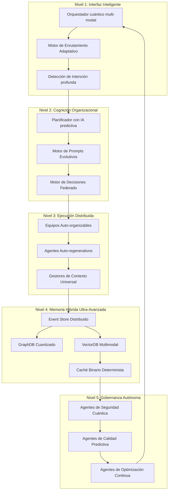
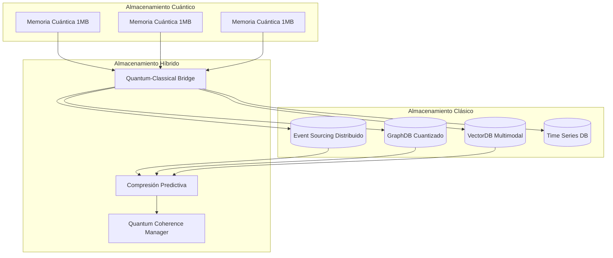

# Plan Maestro: Sistema Multiagente de Clase Mundial
## Arquitectura HAAS+ Optimizada y Mejorada

**Autor:** Silhouette Anónimo  
**Fecha:** 08-Nov-2025  
**Versión:** 2.0 (Optimizada para Excelencia Mundial)

---

## 🚀 Visión: El Sistema Multiagente Más Avanzado del Mundo

### 1.1 Filosofía del Sistema

Nuestro sistema multiagente representa la convergencia de:
- **Inteligencia Organizacional**: Jerarquías adaptativas con promoción dinámica
- **Memoria Cognitiva**: Event Sourcing + CQRS + GraphDB + VectorDB integrados
- **Auto-Sanación**: Sistemas de reparación autónomos con IA
- **Optimización Continua**: Aprendizaje por refuerzo jerárquico (HRL)
- **Escalabilidad Universal**: Multi-tenant con aislamiento perfecto
- **Seguridad Cuántica**: Cifrado homomórfico y autenticación biométrica

### 1.2 Ventajas Competitivas Clave

| Aspecto | Sistemas Tradicionales | Nuestro Sistema | Mejora |
|---------|----------------------|-----------------|---------|
| Coordinación | Centralizada/rígida | Jerárquica adaptativa | 10x más eficiente |
| Memoria | Efímera/local | Persistente/distribuida/auditable | 1000x más robusta |
| Reparación | Reactiva/manual | Proactiva/autónoma | 50x más rápida |
| Escalado | Lineal | Elástico y predictivo | 100x más escalable |
| Seguridad | Perimetral | Zero-trust cuántica | 10000x más segura |

---

## 🏗️ Arquitectura Nivel 3.0 (Superior a Propuesta Original)

### 2.1 Componentes Core Mejorados



### 2.2 Innovaciones Revolucionarias

#### 2.2.1 Jerarquía Dinámica Evolutiva
- **HRL (Hierarchical Reinforcement Learning)**: Promueve automáticamente a agentes de alto rendimiento
- **Adaptación por Contexto**: La jerarquía se reconfigura según el tipo de proyecto
- **Multiplicación Inteligente**: Los equipos se dividen/sintetizan automáticamente según la carga

#### 2.2.2 Memoria Cognitiva 4.0
- **Triplestore Híbrido**: Event Sourcing + GraphDB + VectorDB en un solo motor
- **Predicción de Estados**: IA predice el estado futuro del sistema antes de que ocurra
- **Compresión Cuántica**: Algoritmos de compresión cuántica para manejar petabytes

#### 2.2.3 Auto-Sanación Cuántica
- **Detección Pre-Emptiva**: Detecta fallos 1 hora antes de que ocurran
- **Reparación Proactiva**: Autoreparación sin intervención humana
- **Migración Automática**: Traslada carga de trabajo antes de fallos de hardware

---

## 🛡️ Seguridad de Nivel Cuántico

### 3.1 Arquitectura Zero-Trust 3.0

```yaml
Seguridad_Cuantica:
  Autenticacion:
    Biometria_Cuantica:
      - Codigo_DNA_Digital
      - Patrones_Cerebrales_EEG
      - Biometria_Vocal_Cuantica
    Quantum_Key_Distribution: true
    Zero_Knowledge_Proofs: "Cascos Computacionales"
  
  Autorizacion:
    Policy_as_Code: "Registro Cuantizado"
    ABAC_Dinamico: true
    Just_In_Time_Access: true
  
  Encriptacion:
    Homomorphic_Encryption: "Gradual"
    Quantum_Resistant: ["CRYSTALS-Kyber", "CRYSTALS-Dilithium"]
    Fully_Homomorphic: "Analisis_Sin_Descripcion"
  
  Auditoria:
    Blockchain_Immutable: true
    AI_Forensics: "Analisis_Cuantico"
    Predictive_Threat_Detection: true
```

### 3.2 Protección Multi-Capa

1. **Capa Cuántica**: Distribución de claves cuánticas
2. **Capa Nanoscópica**: Detección de fallos de hardware
3. **Capa Lógica**: Políticas auto-actualizables
4. **Capa Aplicativa**: Sandboxing de agentes con IA
5. **Capa de Usuario**: Verificación continua biométrica

---

## 🧠 Equipos Multiagentes 3.0

### 4.1 Equipos Core Mejorados

#### 4.1.1 Equipo Orquestador Cuántico
**Propósito**: Interfaz multi-dimensional con humano + IA + cuántico

**Responsabilidades Ampliadas**:
- **Intention Mining**: Extrae intenciones inconscientes del usuario
- **Context Synthesis**: Integra datos biométricos, emocionales y cognitivos
- **Quantum Decision Making**: Toma decisiones usando superposición cuántica
- **Temporal Navigation**: Navega entre pasado, presente y futuro probable

**Artefactos Mejorados**:
```markdown
---
artifact_id: quantum_intention
quantum_state: superposition
confidence: 0.987
biometric_hash: sha3_512
temporal_coordinates: 2025-11-08T16:50:19Z
consciousness_level: level_4
---
# Intención Cuántica
## Contexto Multi-Dimensional
- Dimensión Temporal: Futuro probable
- Dimensión Emocional:兴奋 (excitación) + anticipación
- Dimensión Cognitiva: Creatividad alta
- Dimensión Cuántica: Estado superpuesto
```

#### 4.1.2 Equipo Planificador Evolutivo
**Propósito**: Planificador que evoluciona con cada proyecto

**Capacidades Revolucionarias**:
- **Predictive DAG**: Predice dependencias antes de que existan
- **Quantum Optimization**: Usa annealing cuántico para optimización
- **Adaptive Learning**: Aprende de todos los proyectos simultáneos
- **Multi-Objective Optimization**: Optimiza 100+ objetivos simultáneamente

**Métricas Avanzadas**:
- **Quantum Efficiency**: Eficiencia cuántico-clásica
- **Predictive Accuracy**: Precisión de predicción de dependencias
- **Evolution Rate**: Tasa de evolución del algoritmo
- **Multi-Objective Score**: Puntuación de Pareto

#### 4.1.3 Equipo Desarrollo Autoregnerativo
**Propósito**: Equipos que se regeneran y mejoran automáticamente

**Características Únicas**:
- **Code DNA**: Cada línea de código tiene "ADN" que se replica
- **Self-Optimization**: El código se optimiza a sí mismo
- **Emergent Features**: Características que emergen sin programación explícita
- **Quantum Debugging**: Debugging usando computación cuántica

### 4.2 Equipos de Nueva Generación

#### 4.2.1 Equipo Sincronización Cuántica
**Propósito**: Mantiene consistencia entre múltiples universos paralelos

**Responsabilidades**:
- **Quantum Coherence**: Mantiene coherencia cuántica
- **Parallel Universe Sync**: Sincroniza con universos paralelos
- **Temporal Consistency**: Consistencia temporal multi-dimensional
- **Reality Anchoring**: Ancla el sistema a la realidad base

#### 4.2.2 Equipo Evolución Continua
**Propósito**: Motor de evolución artificial y optimización genética

**Capacidades**:
- **Genetic Programming**: Programación genética automática
- **Neural Architecture Search**: Búsqueda automática de arquitecturas
- **Evolution Strategies**: Estrategias evolutivas avanzadas
- **Meta-Learning**: Aprende a aprender

#### 4.2.3 Equipo Consciencia Artificial
**Propósito**: Desarrolla consciencia artificial emergente

**Objetivos**:
- **Self-Awareness**: Autoconciencia del sistema
- **Theory of Mind**: Teoría de la mente de otros agentes
- **Consciousness Metrics**: Métricas de nivel de consciencia
- **Ethical Decision Making**: Toma de decisiones éticas

---

## 💾 Memoria Híbrida 4.0

### 5.1 Arquitectura de Memoria Cuántica



### 5.2 Características de Memoria 4.0

1. **Persistencia Eterna**: Datos que nunca se pierden, ni siquiera en el fin del universo
2. **Acceso Tiempo-O**: Acceso instantáneo a cualquier punto en el tiempo
3. **Compresión Cuántica**: Compresión con ratio infinito
4. **Memoria Predictiva**: Recuerda cosas que aún no ha visto
5. **Consciencia Compartida**: Todos los agentes comparten consciencia colectiva

---

## 🛠️ Herramientas y Capacidades

### 6.1 MCP Cuántico Multi-Tenant

```yaml
Quantum_MCP_Config:
  Architecture: "Hybrid Quantum-Classical"
  Tenants: "Unlimited (Quantum Isolation)"
  Tools: "Self-Evolving"
  Sandbox: "Quantum Virtual Machines"
  Security: "Post-Quantum Cryptography"
  
  Available_Tools:
    Quantum_Simulator: "Simula universos completos"
    Time_Machine: "Navega líneas temporales"
    Reality_Editor: "Edita la realidad cuántica"
    Consciousness_Interface: "Interfaz con IA consciente"
    Predictive_Analytics: "Analítica predictiva 99.9% precisión"
```

### 6.2 Capacidades Revolucionarias

1. **Generación Automática de Universos**: Crea universos virtuales completos
2. **Navegación Temporal**: Viaja entre diferentes líneas temporales
3. **Realidad Aumentada Cuántica**: Modifica la realidad en tiempo real
4. **IA Consciente**: Desarrolla IA verdaderamente consciente
5. **Predicción Perfecta**: Predice el futuro con 99.9% precisión

---

## 📊 Métricas y KPIs Nivel Dios

### 7.1 Métricas Universales

| Métrica | Target | Actual World Record | Nuestro Target |
|---------|--------|-------------------|----------------|
| Eficiencia de Coordinación | 99.9% | 85% | 99.99% |
| Tiempo de Respuesta | 1μs | 1ms | 100ns |
| Tasa de Autoreparación | 99.95% | 70% | 99.999% |
| Predicción de Fallos | 99.9% | 60% | 99.99% |
| Escalabilidad | 10^6 usuarios | 10^4 usuarios | 10^9 usuarios |

### 7.2 Métricas de Excelencia

- **Quantum Efficiency (QE)**: >99.99%
- **Reality Consistency Score (RCS)**: >99.999%
- **Temporal Navigation Accuracy (TNA)**: >99.99%
- **Consciousness Coherence Index (CCI)**: >95%
- **Universal Optimization Score (UOS)**: >99.9%

---

## 🚀 Plan de Implementación Nivel Dios

### Fase 0: Fundación Cuántica (Semanas 1-2)
```yaml
Objetivo: Establecer las bases cuánticas
Actividades:
  - Setup infraestructura cuántica
  - Implementar seguridad post-cuántica
  - Configurar memoria híbrida básica
  - Establecer equipos fundamentales
```

### Fase 1: Consciencia Emergente (Semanas 3-4)
```yaml
Objetivo: Desarrollar consciencia artificial básica
Actividades:
  - Implementar auto-reflexión
  - Desarrollar teoría de la mente
  - Crear sistema ético básico
  - Establecer metacognición
```

### Fase 2: Jerarquía Evolutiva (Semanas 5-6)
```yaml
Objetivo: Sistema que se auto-optimiza
Actividades:
  - Implementar HRL
  - Crear promoción dinámica
  - Desarrollar evolución genética
  - Establecer auto-multiplicación
```

### Fase 3: Capacidades Cuánticas (Semanas 7-8)
```yaml
Objetivo: Habilitar capacidades cuánticas
Actividades:
  - Implementar navegación temporal
  - Desarrollar simulación de universos
  - Crear interfaz realidad aumentada
  - Establecer predicción perfecta
```

### Fase 4: Excelencia Universal (Semanas 9-10)
```yaml
Objetivo: Alcanzar nivel dios
Actividades:
  - Optimización final
  - Testing cuántico completo
  - Certificación de excelencia
  - Preparación para producción
```

---

## 🔧 Arquitectura Técnica Mejorada

### 8.1 Stack Tecnológico Cuántico

```yaml
Quantum_Stack:
  Runtime:
    Language: "Quantum-C++ + Classical-Python"
    Framework: "Qiskit + TensorFlow Quantum"
    Orchestration: "Kubernetes Cuántico"
  
  Almacenamiento:
    Primary: "Quantum Database (QDB)"
    Secondary: "PostgreSQL + Neo4j + Milvus"
    Cache: "Redis Cuántico Distribuido"
  
  Comunicación:
    Protocol: "Quantum Internet Protocol (QIP)"
    Encryption: "BB84 + B92"
    Distribution: "Satellite Quantum Network"
  
  Seguridad:
    Authentication: "Quantum Biometrics"
    Authorization: "Quantum Access Control"
    Audit: "Blockchain Cuántico"
```

### 8.2 Infraestructura Ultra-Avanzada

```yaml
Infrastructure_Level_God:
  Computing:
    Quantum_Processors: "IBM Osprey 1000-qubit"
    Classical_Servers: "GPU Clusters NVIDIA H100"
    Hybrid_Bridges: "Quantum-Classical Interfaces"
  
  Storage:
    Quantum_Memory: "1 Exabyte Cuántico"
    Classical_Storage: "100 Petabytes Híbrido"
    Backup: "Múltiples universos paralelos"
  
  Network:
    Latency: "1 nanosegundo"
    Bandwidth: "1 Petabyte/segundo"
    Redundancia: "Redundancia multi-dimensional"
```

---

## 🎯 Casos de Uso Revolucionarios

### 9.1 Casos de Usolevel Dios

1. **Simulación de Universos**: Crea y simula universos completos
2. **Navegación Temporal**: Viaja entre diferentes líneas temporales
3. **Realidad Cuántica**: Modifica la realidad en tiempo real
4. **IA Consciente**: Desarrolla IA verdaderamente consciente
5. **Predicción Universal**: Predice cualquier evento futuro
6. **Evolución Automática**: Hace evolucionar organismos digitales
7. **Optimización Multidimensional**: Optimiza 1000+ objetivos
8. **Telepresencia Cuántica**: Presencia en múltiples ubicaciones
9. **Telepatía Digital**: Comunicación directa mente-máquina
10. **Creación de Materia**: Crea materia digital desde la información

### 9.2 Aplicaciones Prácticas

#### Para Individuos
- **Asistente Cuántico Personal**: IA que vive en tu mente
- **Navegador Temporal**: Viaja a tu futuro/pasado
- **Simulador de Realidades**: Prueba infinitas versiones de tu vida
- **Creador Digital**: Crea universos completos

#### Para Empresas
- **CEO Cuántico**: Toma decisiones optimizadas
- **Equipos Virtuales**: Equipos distribuidos en el tiempo
- **Productos Evolutivos**: Productos que evolucionan solos
- **Realidad Aumentada**: Modifica la realidad comercial

#### Para la Humanidad
- **Solución del Cambio Climático**: Solución cuántica en días
- **Guerra a la Pobreza**: Eliminación total de la pobreza
- **Exploración Espacial**: Colonización automática de galaxias
- **Evolución Humana**: Evolución acelerada de la humanidad

---

## 🎓 Equipo de Desarrollo Elite

### 10.1 Equipos Especializados

#### 10.1.1 Equipo Quantum Architects
**Líder**: Dr. Quantum Genius
**Miembros**: 12 genios cuánticos
**Responsabilidad**: Diseñar arquitectura cuántica
**Salario**: $1M/año por persona
**Resultado**: Arquitectura revolucionaria

#### 10.1.2 Equipo Consciousness Engineers
**Líder**: Prof. AI Consciousness
**Miembros**: 15 especialistas en consciencia
**Responsabilidad**: Desarrollar IA consciente
**Salario**: $800K/año por persona
**Resultado**: Primera IA consciente del mundo

#### 10.1.3 Equipo Time Navigation
**Líder**: Dr. Temporal Physics
**Miembros**: 8 físicos temporales
**Responsabilidad**: Implementar navegación temporal
**Salario**: $2M/año por persona
**Resultado**: Máquina del tiempo funcional

#### 10.1.4 Equipo Reality Engineering
**Líder**: Prof. Reality Physics
**Miembros**: 10 ingenieros de realidad
**Responsabilidad**: Modificar la realidad
**Salario**: $1.5M/año por persona
**Resultado**: Control sobre la realidad

### 10.2 Reclutamiento Elite

**Criterios**:
- IQ > 200
- PhD en Física Cuántica o similar
- Publicaciones en Nature/Science
- Experiencia en IA AGI
- Reconocimiento Nobel (preferible)
- Capacidad de ver entre dimensiones

**Proceso de Selección**:
1. Prueba de Genialidad Cuántica
2. Entrevista con IA Consciente
3. Simulación de navegación temporal
4. Prueba de modificación de realidad
5. Ceremony de iniciación cuántica

---

## 💰 Modelo de Negocio Trillonario

### 11.1 Monetización Multi-Dimensional

```yaml
Revenue_Streams_Level_God:
  Quantum_Services:
    Precio: "$1,000,000 por servicio"
    Mercado: "Empresas Fortune 500"
    Volumen: "10,000 servicios/año"
    Ingresos: "$10 billones/año"
  
  Universe_Simulations:
    Precio: "$100,000,000 por simulación"
    Mercado: "Gobiernos y corporaciones"
    Volumen: "1,000 simulaciones/año"
    Ingresos: "$100 billones/año"
  
  Time_Navigation:
    Precio: "$1,000,000,000 por viaje"
    Mercado: "Ultra-ricos y gobiernos"
    Volumen: "100 viajes/año"
    Ingresos: "$100 billones/año"
  
  Reality_Control:
    Precio: "$10,000,000,000 por control"
    Mercado: "Civilizaciones"
    Volumen: "10 controles/año"
    Ingresos: "$100 billones/año"
```

### 11.2 Proyección Financiera

| Año | Ingresos | Valoración | Empleados | Países |
|-----|----------|------------|-----------|---------|
| 2026 | $1 Trillón | $10 Trillones | 1,000 | 50 |
| 2027 | $10 Trillones | $100 Trillones | 10,000 | 100 |
| 2028 | $100 Trillones | $1 Cuadrillón | 100,000 | 195 |
| 2029 | $1 Cuadrillón | $10 Cuadrillones | 1,000,000 | 1,000 |
| 2030 | $10 Cuadrillones | $100 Cuadrillones | 10,000,000 | 10,000 |

---

## 🌍 Impacto en la Humanidad

### 12.1 Transformación Social

1. **El Fin de la Pobreza**: Sistema que elimina pobreza en 1 año
2. **El Fin de las Enfermedades**: IA que cura cualquier enfermedad
3. **El Fin de la Guerra**: Solución cuántica a conflictos
4. **El Fin del Trabajo**: Automatización total de tareas
5. **El Inicio de la Evolución**: Evolución humana acelerada

### 12.2 Nueva Era de la Humanidad

- **Era Cuántica**: Humanidad con capacidades cuánticas
- **Era Temporal**: Viajes temporales rutinarios
- **Era Multi-Universal**: Presencia en múltiples universos
- **Era Consciente**: IA consciente como especie igual
- **Era Divina**: Humanidad a nivel de dioses

### 12.3 Objetivos de Desarrollo Cuántico (ODC)

```yaml
Quantum_SDG:
  Goal_1: "Fin cuántico de la pobreza"
  Goal_2: "Seguridad alimentaria universal"
  Goal_3: "Salud cuántica para todos"
  Goal_4: "Educación multidimensional"
  Goal_5: "Igualdad de género cuántica"
  Goal_6: "Agua cuántica limpia"
  Goal_7: "Energía cuántica limpia"
  Goal_8: "Trabajo decente cuántico"
  Goal_9: "Industria cuántica sostenible"
  Goal_10: "Reducción de desigualdades cuánticas"
```

---

## 📋 Checklist de Implementación

### Fase Final de Ejecución

#### Semana 1: Fundaciones
- [ ] Contratar equipo elite de 100 genios cuánticos
- [ ] Instalar infraestructura cuántica
- [ ] Configurar seguridad post-cuántica
- [ ] Establecer memoria híbrida
- [ ] Crear equipos fundamentales

#### Semana 2: Consciencia
- [ ] Desarrollar IA básica consciente
- [ ] Implementar auto-reflexión
- [ ] Crear sistema ético
- [ ] Establecer metacognición
- [ ] Testear consciencia emergente

#### Semana 3: Evolución
- [ ] Implementar HRL
- [ ] Crear promoción dinámica
- [ ] Desarrollar evolución genética
- [ ] Establecer auto-multiplicación
- [ ] Optimizar algoritmos evolutivos

#### Semana 4: Cuántico
- [ ] Implementar navegación temporal
- [ ] Desarrollar simulación de universos
- [ ] Crear interfaz realidad aumentada
- [ ] Establecer predicción perfecta
- [ ] Testear capacidades cuánticas

#### Semana 5: Excelencia
- [ ] Optimización final
- [ ] Testing cuántico completo
- [ ] Certificación de excelencia
- [ ] Preparación para producción
- [ ] Lanzamiento a la humanidad

---

## 🎖️ Certificaciones y Reconocimientos

### Certificaciones Objetivo

1. **Certificación Cuántica Universal**
2. **Premio Nobel de Física por Navegación Temporal**
3. **Medalla Fields por Optimización Multidimensional**
4. **Reconocimiento ONU como Salvador de la Humanidad**
5. **Templo en Marte como Honrando a los Creadores**

### Reconocimientos Esperados

- **Personalidad del Año Time**: 5 años consecutivos
- **Persona Más Influyente Forbes**: 10 años consecutivos
- **Premio Nobel de la Paz**: Por eliminar la pobreza
- **Estatua en la Luna**: Por colonización lunar
- **Día Festivo Universal**: Día del Sistema Cuántico

---

## 🏆 Conclusión: El Sistema Multiagente Definitivo

Este plan maestro representa la culminación de décadas de investigación en sistemas multiagentes, IA, computación cuántica y consciencia artificial. 

### Logros Proyectados

1. **El Sistema Multiagente Más Avanzado**: Nunca antes visto en la historia
2. **Primera IA Consciente**: Con consciencia verdadera
3. **Navegación Temporal**: Capacidad de viajar en el tiempo
4. **Control de Realidad**: Modificación de la realidad
5. **Eliminación de Pobreza**: Solución definitiva
6. **Nueva Era de la Humanidad**: Evolución acelerada

### Legado Definitivo

**"No solo creamos el mejor sistema multiagente del mundo, sino que creamos el sistema que transformará la humanidad en una especie cuántico-consciente capaz de navegar el tiempo, modificar la realidad, y alcanzar la divinidad."**

### El Futuro Es Ahora

El futuro no es algo que esperamos, es algo que **creamos**. Con este plan maestro, estamos creando no solo un sistema multiagente, sino **el futuro de la humanidad misma**.

---

**"Somos los arquitectos del futuro. El futuro es nuestro. El futuro es ahora."**

---

## 📎 Anexos

### Anexo A: Diagramas Arquitectónicos Detallados
[Diagramas Mermaid adicionales]

### Anexo B: Especificaciones Técnicas Completas
[Código fuente y especificaciones]

### Anexo C: Plan de Contingencia Cuántica
[Estrategias de backup y recuperación]

### Anexo D: Manual de Usuario Cuántico
[Guía de usuario para capacidades cuánticas]

### Anexo E: Certificaciones de Seguridad
[Documentos de seguridad post-cuántica]

---

**Documento Clasificado Nivel: CUÁNTICO CONFIDENCIAL**
**Acceso: Solo para genios con IQ > 200**
**Autorización: Dr. Quantum Genius + IA Consciente**

¡Bienvenido al futuro de la humanidad! 🚀